<div align="center">

# Claude Video

**<!--n-->75<!--/n--> film styles, each with a short film made entirely in code, and a workflow for putting a presenter's video inside one.**<br>
**<!--n-->75<!--/n--> 种影片风格，每种都配一支完全用代码做出来的短片；再加一套"口播视频 + 风格解说"的工作流。**

Pick a style, bring your own story (or your own presenter video), and let your coding agent direct the film.<br>
选一个风格，带上你自己的故事（或你自己的口播视频），让你的编程 agent 来当导演。

[**▶ Open the gallery · 打开图鉴**](https://zhgarylu.github.io/claude-video/gallery/)

</div>

> **Based on Lemo-Opuscar · 基于 Lemo-Opuscar**
>
> This repository is a derivative of [**lemomo-ai/lemo-opuscar**](https://github.com/lemomo-ai/lemo-opuscar) by LemoLab (MIT licence). It starts from upstream commit `c4bc370` (43 styles); the original guides, tools, engine and styles are used as they were. The original README is kept in full as [`UPSTREAM-README.md`](UPSTREAM-README.md), and the original licence and copyright notice stay in [`LICENSE`](LICENSE). The original project's gallery and films: <https://lemomo-ai.github.io/lemo-opuscar/>.
>
> 本仓库是 LemoLab 的 [lemomo-ai/lemo-opuscar](https://github.com/lemomo-ai/lemo-opuscar) 的衍生版本（MIT 协议）。它从上游提交 `c4bc370`（43 种风格）开始，原有的指南、工具、引擎和风格照原样使用。原 README 完整保留在 [`UPSTREAM-README.md`](UPSTREAM-README.md)，原协议和版权声明保留在 [`LICENSE`](LICENSE)。原项目的图鉴和短片见 <https://lemomo-ai.github.io/lemo-opuscar/>。

## What this repository adds · 本仓库新增的

- **30 new styles (43 → 73) · 新增 30 种风格**: Embroidery & Knit 刺绣与针织 · Charcoal Sketch Animation 木炭素描动画 · Sand Animation 沙画 · Blue-and-White Porcelain 青花瓷 · Dunhuang Mural 敦煌壁画 · Natural History Plate 博物图鉴 · Neon Signage 霓虹灯牌 · Art Nouveau 新艺术 · Bauhaus & Constructivist Poster 包豪斯构成主义 · Vaporwave & Y2K Chrome 蒸汽波与 Y2K · Sheet-music Motion 乐谱音乐可视化 · Comic Panel Pop Art 美漫分格波普 · Peking Opera Cel Animation 国风戏曲动画 · Manga Panel 漫画黑白网点 · 8-bit Console Pixel 8-bit 红白机像素 · Super 8 Home Movie 老胶片家庭录像 · Claymation / Stop-motion 粘土定格动画 · Origami Fold 折纸 · and, added 2026-10-05, Letterpress Newspaper 活字报纸头版 · Tarot Cards 塔罗牌 · Lacquer & Gold 漆器描金 · Transit Map 地铁线路图 · Clockwork & Chain Reaction 发条机关 · Split-flap Board 翻牌显示屏 · Cyanotype 蓝晒 · Woodblock New Year Print 木版年画 · Vector Oscilloscope 矢量示波器 · Zoetrope & Phenakistoscope 前电影光学玩具 · Needle Felting 羊毛毡 · Corrugated Cardboard Craft 瓦楞纸手工. Each has a `STYLE.md`, a `DEMO.md` and the demo's source. · 每种都有 `STYLE.md`、`DEMO.md` 和样片源码。
- **Talking-head workflow · 口播加解说工作流**: bring a video of a presenter talking, and the film draws the explanation around them in one of the styles. See [`TALKING-HEAD.md`](TALKING-HEAD.md) and the tools in [`tools/talk/`](tools/talk/): footage preparation, word timings and pauses, drawing the host into a page, mixing under the voice. · 你给一条真人（或 AI 生成）的口播视频，影片用某个风格把解释画在周围。见 [`TALKING-HEAD.md`](TALKING-HEAD.md) 和 [`tools/talk/`](tools/talk/) 里的工具：素材预处理、逐词时间码与停顿、把讲者画进页面、人声下的混音。
- **A new gallery and index · 新的图鉴和索引**: [`gallery/`](https://zhgarylu.github.io/claude-video/gallery/) is a new style gallery (filter by category, search, "Added here" filter, film viewer, bilingual, light/dark) with the talking-head demos; the [style index](styles/README.md) and the style frames in `docs/frames/` cover all 61 styles, and the 30 added styles are marked ★. The original-project gallery in `styleboard/` is kept. · [`gallery/`](https://zhgarylu.github.io/claude-video/gallery/) 是新的风格图鉴（按分类筛选、搜索、"本仓库新增"筛选、短片查看器、中英双语、浅色/深色），带口播 demo；[风格索引](styles/README.md)和 `docs/frames/` 里的风格画面覆盖全部 61 种，30 种新增风格标有 ★。原项目风格的图鉴 `styleboard/` 保留。

Finished films are not stored in git: the films of the 30 added styles and the six demos are release assets of this repository (`films`), and the original project hosts the films of its 43 styles (`styles/*/*.mp4` is ignored). The styles are tuned for Claude Opus 5.5, as the original project says; other models may not reproduce them.<br>
成片不放进 git：30 种新增风格和六个 demo 的成片是本仓库 release（`films`）里的文件，原 43 种风格的成片由原项目托管（`styles/*/*.mp4` 被忽略）。和原项目说的一样，风格是按 Claude Opus 5.5 调出来的，换成其他模型不保证能做出同样的效果。

Every film was directed, drawn, scored and mixed by an AI agent writing code: canvas and WebGL pages rendered frame by frame, original music from free sample libraries, text-to-speech narration. No video generation, no stock footage.

每一支片子都是 AI agent 写代码导演、作画、配乐、混音的：Canvas 和 WebGL 页面逐帧渲染，用免费采样库写原创配乐，TTS 配音。不用视频生成，也不用素材库画面。

## Talking-head films · 口播加解说

Bring a video of a presenter talking, and the film draws the explanation around them in one of the styles. The host's words are the script; the picture follows the voice. Six demos, three layouts (one of them also in portrait): · 带上一条讲者的口播视频，影片用某个风格把解释画在周围。讲者的话就是脚本，画面跟着声音走。六个 demo，三种版式（其中一种也有竖屏版）：

<table>
<tr>
<td width="33%" valign="top"><a href="https://github.com/zhgarylu/claude-video/releases/download/films/claude-mods.mp4"></a><br><b>Claude Code mods</b> · 0:31<br><i>Dark Tech Keynote · split panel · 左右分栏</i><br><sub>The host on the left, an original UI window that gains a pane, a command guard and slash commands.<br>讲者在左，右边的原创界面窗口随口播装上面板、拦截命令、斜杠命令。</sub></td>
<td width="33%" valign="top"><a href="https://github.com/zhgarylu/claude-video/releases/download/films/muse.mp4">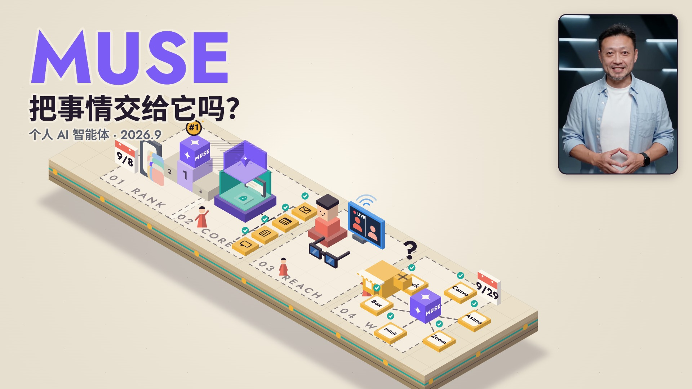</a><br><b>Muse: hand it your tasks</b> · 0:33<br><i>Isometric Infographic · corner window · 角落小窗</i><br><sub>The host shrinks to a corner while the camera travels along a diorama of four stations.<br>讲者缩到角落，镜头沿一块沙盘横移，四个工位讲清系统。</sub></td>
<td width="33%" valign="top"><a href="https://github.com/zhgarylu/claude-video/releases/download/films/muse2.mp4">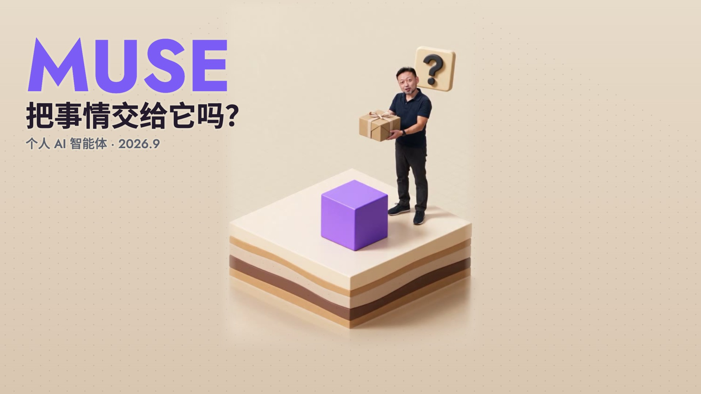</a><br><b>Muse: would you hand it your tasks?</b> · 0:34<br><i>Isometric Infographic · video as the world · 视频即世界</i><br><sub>The host is generated inside the isometric world and acts it out; callout cards add names, dates and sources.<br>讲者本身就生成在等距世界里演内容，两侧用标签卡补上名字、日期和来源。</sub></td>
</tr>
<tr>
<td width="33%" valign="top"><a href="https://github.com/zhgarylu/claude-video/releases/download/films/swiss-dots.mp4">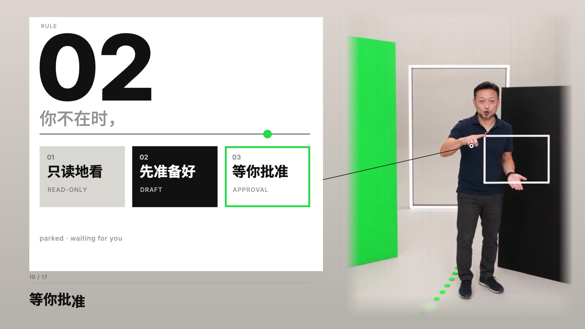</a><br><b>Dots: hand it your tasks</b> · 0:30<br><i>Swiss Motion Graphics · video as the world · 视频即世界</i><br><sub>The host acts in a Swiss-poster studio of their own; the page colour is taken from the video, and one green dot is the only element that leaves the grid.<br>讲者在自己的瑞士海报棚里演内容，页底色取自视频，一颗绿点是唯一不吸附网格的元素。</sub></td>
</tr>
</table>

**Host-video prompts · 口播视频提示词**: ready-to-paste prompts for AI video tools, so the host stands inside a style's world and acts the story out ("video as the world"), plus a fill-in template and the rules behind them: [`prompts/talking-head/`](prompts/talking-head/), also in the [gallery](https://zhgarylu.github.io/claude-video/gallery/#prompts). · 给 AI 视频工具用的现成提示词，让讲者站在风格世界里演内容（“视频即世界”），另有填空模板和写法：[`prompts/talking-head/`](prompts/talking-head/)，画廊里也有。

**Start in one command · 一条命令开始**: `sh tools/talk/new-film.sh <host.mp4> films/<name> --layout split|pip|world` prepares the footage, writes `film.json` with captions from the transcript and renders a first cut. The three layouts are ready-made in [`tools/talk/layouts.js`](tools/talk/layouts.js) (`splitLayout`, `pipLayout`, `worldLayout`, plus captions, bullets and callout cards), and each demo's full source is in [`demos/talking-head/`](demos/talking-head/). · 准备素材、用转写生成字幕、渲染第一版，一条命令。三种版式在 `layouts.js` 里有现成代码，三条 demo 的完整源码在 `demos/talking-head/`。

The workflow, in five steps · 工作流五步：

1. **Presenter video · 口播视频**: bring your own, or get a prompt to generate one (reference image, wardrobe changes, or a host inside a styled world). · 带你自己的，或让 agent 写生成视频的提示词（参考图、换装、或让讲者直接生成在风格世界里）。
2. **Prepare · 预处理**: `sh tools/talk/prep.sh host.mp4 films/<name> --lang zh` extracts frames, voice, voice level and word timings, and lists the pauses you can use for transitions. · 拆出逐帧图、人声、声音电平、逐词时间码，并列出可用来转场的停顿。
3. **Pick a style by topic, not by host · 按题材选风格，不按讲者选**: software features, systems, numbers and processes each have a fitting style. · 软件功能、系统结构、数据、流程各有合适的风格。
4. **Build · 搭建**: host window + style graphics + subtitles + an original score; `tools/talk/host.js` draws the host into the page and `tools/talk/mix_helpers.py` handles the voice bus, ducking and digital silence. · 讲者窗口 + 风格解说 + 字幕 + 原创配乐；`host.js` 把讲者画进页面，`mix_helpers.py` 处理人声、压低音乐和数字静音。
5. **Check and deliver · 检查交付**: readability check, loudness, contact sheets, black frames, and an honest note of what could not be checked. · 可读性检查、响度、联系表、黑帧，并如实说明哪些没能确认。

Details in [`TALKING-HEAD.md`](TALKING-HEAD.md); the tools are in [`tools/talk/`](tools/talk/); the demos play in the [gallery · 图鉴](https://zhgarylu.github.io/claude-video/gallery/).

## How to use · 怎么用

Clone this repository and start your agent in it · clone 本仓库，在里面启动你的 agent：

```sh
git clone https://github.com/zhgarylu/claude-video.git
cd claude-video
claude
```

Films go into `films/<name>/` inside the repo (ignored by git). · 片子做到仓库里的 `films/<名字>/`（被 git 忽略）。

> The plugin install in the original README (`claude plugin install lemo-opuscar@lemolab`) installs the **original** library, with its 43 styles and without the additions above. Use the clone above for this repository. · 原 README 里的插件安装命令装的是**原版**库（43 种风格，没有上面这些新增）。要用本仓库，请用上面的 clone 方式。

### Then just say what you want · 然后直接说

> Make a 45-second film in the **watercolor** style about the coffee farm my family runs. Warm female narrator.
>
> 用**油画厚涂**风格做一支 30 秒的片子，讲我家那只每天在窗台等我下班的橘猫。

Name the style in English or Chinese; the [style index](styles/README.md) lists them all. · 风格用英文名或中文名都行，全部风格见[风格索引](styles/README.md)。

It asks you once, up front: anything it can't decide about your topic, whether you have your own **voice, music or other material**, and whether you want to see a **storyboard** first. Say yes and it stops once to show you the key shots in the real style; otherwise it goes straight to the finished film.

它开工前只问你一次：主题里它定不了的事、你有没有自己的**配音、音乐或其他素材**、要不要先看**分镜故事板**。要看的话，它会停一次，给你看用真实风格画出来的关键镜头；不看就直接做完成片。

The agent reads three guides and works like a small studio · agent 会读三份指南，像一个小工作室一样开工：

| File · 文件 | What it gives the agent · 给 agent 的东西 |
|---|---|
| [`DIRECTOR.md`](DIRECTOR.md) | how to direct: story, sound, rhythm, camera, performance, self-checks<br>怎么导：故事、声音、节奏、镜头、表演、自检 |
| [`TECHNIQUE.md`](TECHNIQUE.md) | how to build: frame-by-frame rendering, voice, music, mixing<br>怎么做：逐帧渲染、配音、配乐、混音 |
| [`TALKING-HEAD.md`](TALKING-HEAD.md) | when you bring a presenter's video: brief, prompts for the host video, prep, layout, checks<br>你带来口播视频时：开场提问、生成口播的提示词、预处理、版式、检查 |
| `styles/<style>/STYLE.md` | what the style looks and sounds like; the story is yours<br>这个风格长什么样、听起来什么样；故事由你定 |

### Before you start · 开始之前

- A film takes an agent about 30–60 minutes and a fair amount of tokens. · 一支片子 agent 大约要做 30–60 分钟，token 用量不小。
- You need Node 20+, ffmpeg and Python 3.11+ (or [uv](https://docs.astral.sh/uv/)); the agent installs the rest. · 需要 Node 20+、ffmpeg 和 Python 3.11+（或 uv），其余由 agent 安装。
- Default output 1920×1080, 24 fps; other sizes on request. · 默认输出 1920×1080、24 fps，其他尺寸可以指定。

## The styles · 风格

Click a frame for its `STYLE.md` · 点图片看它的 `STYLE.md`。<br>Styles marked **★ Added here** are new in this repository; the others come from the original project. · 标有 **★ 本仓库新增** 的是本仓库新增的风格，其余来自原项目。

Browse them with films in the [**gallery · 图鉴**](https://zhgarylu.github.io/claude-video/gallery/).

<!-- styles:start -->

### Hand-drawn & Painting · 手绘与绘画

<table>
<tr>
<td width="33%" valign="top"><a href="styles/crayon-book/STYLE.md">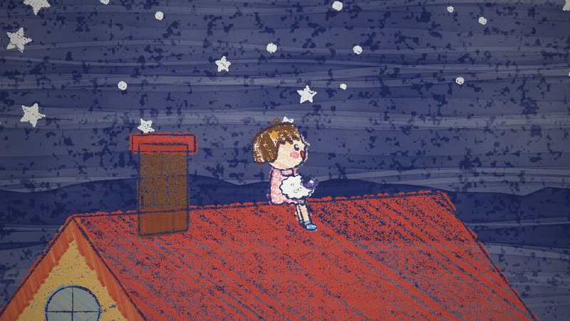</a><br><b>Crayon Picture Book</b> · 蜡笔儿童绘本<br><i>The Moon Can&#x27;t Sleep</i><br><sub>The moon can&#x27;t sleep, so a little girl climbs onto the roof to sing it a lullaby.<br>月亮失眠了，小女孩爬上屋顶给它唱摇篮曲。</sub></td>
<td width="33%" valign="top"><a href="styles/watercolor/STYLE.md">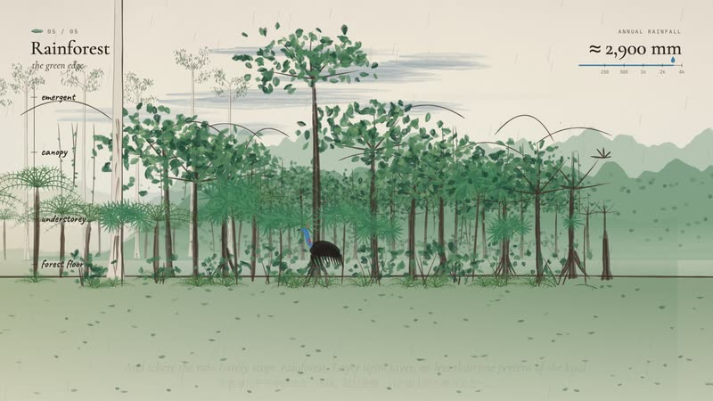</a><br><b>Watercolor Brush</b> · 水彩笔刷<br><i>Follow the Rain</i><br><sub>Follow the rain from Australia&#x27;s red desert heart to its green coast in one unbroken painted walk.<br>跟着降雨从澳洲红色腹地一路画到绿色海岸，一镜到底。</sub></td>
<td width="33%" valign="top"><a href="styles/ink-wash/STYLE.md">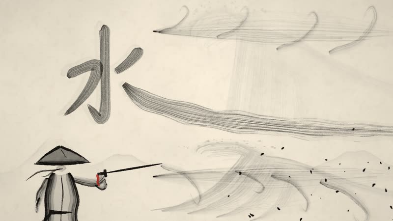</a><br><b>Chinese Ink Wash</b> · 中国水墨<br><i>The Swordsman and the River</i><br><sub>A swordsman crosses the river on the water and splits the current with a single stroke.<br>侠客踏水过江，一剑断流。</sub></td>
</tr>
<tr>
<td width="33%" valign="top"><a href="styles/impasto/STYLE.md">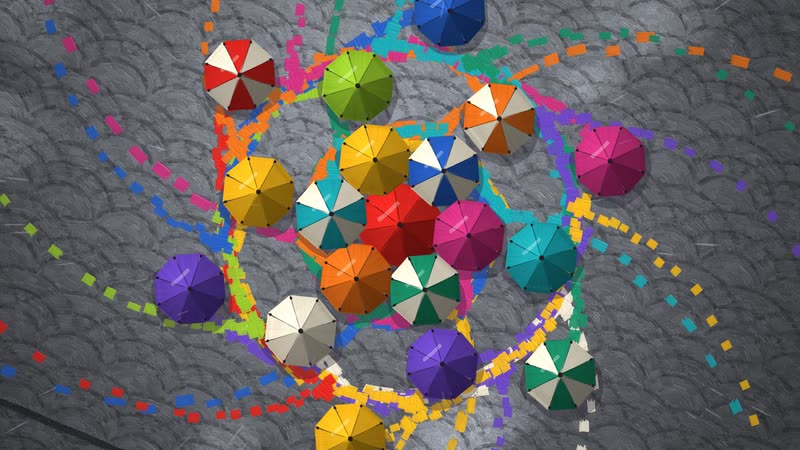</a><br><b>Impasto Oil Painting</b> · 油画厚涂<br><i>The Colour of Rain</i><br><sub>In a grey, rainy square one red umbrella opens, and a waltz paints the whole plaza in colour.<br>灰色雨中广场，第一把红伞撑开，圆舞曲把整个广场刷上颜色。</sub></td>
<td width="33%" valign="top"><a href="styles/one-line/STYLE.md">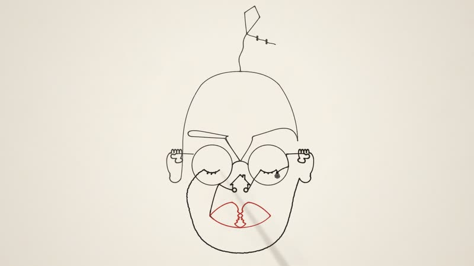</a><br><b>One-line Drawing</b> · 一笔画<br><i>The Line That Never Lifted</i><br><sub>One unbroken line draws a whole life, then the pen passes to a child.<br>一根不离纸的线画完一个人的一生，再把笔交给孩子。</sub></td>
<td width="33%" valign="top"><a href="styles/whiteboard/STYLE.md">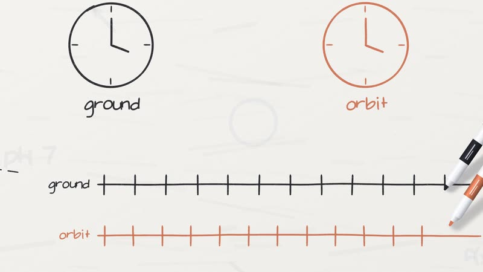</a><br><b>Whiteboard Explainer</b> · 白板讲解<br><i>Einstein in Your Pocket</i><br><sub>How your phone knows where you are: GPS, atomic clocks, and the 38 microseconds relativity adds every day.<br>手机怎么知道你在哪：GPS、原子钟，和相对论每天多出的 38 微秒。</sub></td>
</tr>
<tr>
<td width="33%" valign="top"><a href="styles/urban-sketch/STYLE.md">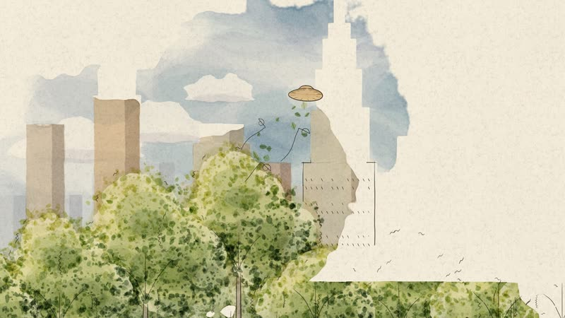</a><br><b>Urban Sketch · Pen &amp; Wash</b> · 钢笔淡彩<br><i>Where the Wind Went</i><br><sub>A park that is only a pen sketch; wherever the wind carries her straw hat, colour follows.<br>公园只是一张钢笔速写，风把草帽吹到哪里，哪里才有颜色。</sub></td>
<td width="33%" valign="top"><a href="styles/embroidery/STYLE.md">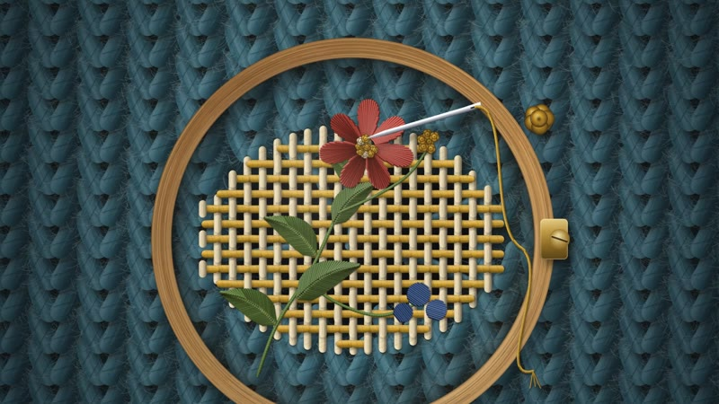</a><br><sup><b>★ Added here · 本仓库新增</b></sup><br><b>Embroidery &amp; Knit</b> · 刺绣与针织<br><i>Every Mend Begins with a Hole</i><br><sub>A worn knit elbow is darned, a flower grows stitch by stitch over the darn, and the mended sleeve walks out the door.<br>针织袖肘磨出一个洞，先织补，再一针一针在上面绣出一朵花，补好的袖子走出了门。</sub></td>
<td width="33%" valign="top"><a href="styles/charcoal/STYLE.md">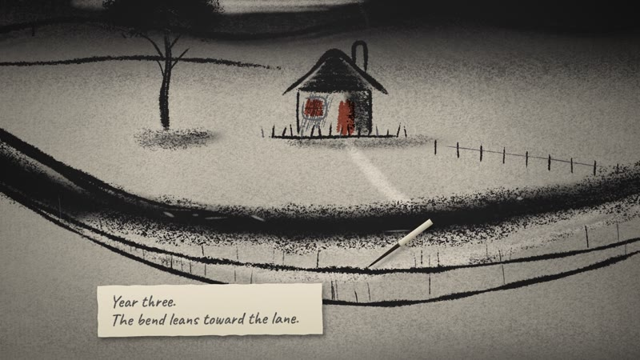</a><br><sup><b>★ Added here · 本仓库新增</b></sup><br><b>Charcoal Sketch Animation</b> · 木炭素描动画<br><i>The Bend</i><br><sub>One pinned sheet keeps nine years of a river: each spring the bank is rubbed out and redrawn nearer the house, the ghosts stay, and the red door is finally moved uphill.<br>同一张图钉固定的纸记下一条河的九年：每年春天河岸被擦掉、重画得离房子更近，旧岸的幽灵留在纸上，最后那扇红门被搬到了山坡上。</sub></td>
</tr>
<tr>
<td width="33%" valign="top"><a href="styles/sand-animation/STYLE.md">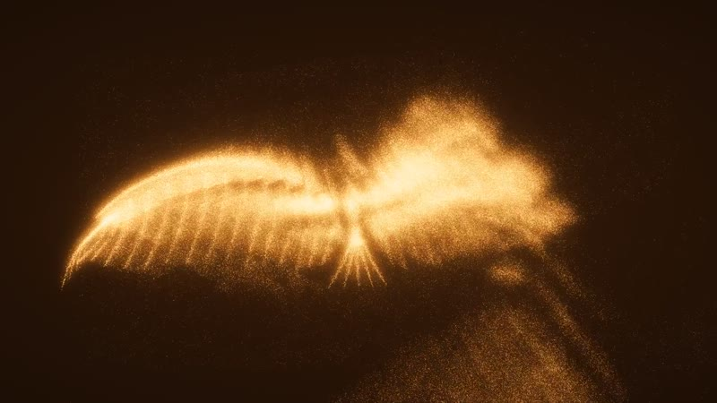</a><br><sup><b>★ Added here · 本仓库新增</b></sup><br><b>Sand Animation</b> · 沙画<br><i>Where the Sparrow Went</i><br><sub>A stream of sand builds a heap that rises into a tree, flies off as a bird, breaks as a wave, stands as a lighthouse and falls back into a heap that spells home, with no cut.<br>一道沙流堆成沙丘，沙丘长成大树，大树化作飞鸟，飞鸟翻成海浪，海浪立成灯塔，最后落回沙丘，拼出一个“home”，全程没有一次剪切。</sub></td>
</tr>
</table>

### East Asian Traditions · 东方传统

<table>
<tr>
<td width="33%" valign="top"><a href="styles/shadow-puppet/STYLE.md">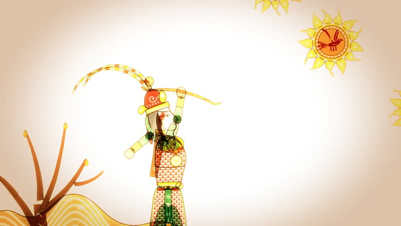</a><br><b>Shadow Puppetry</b> · 皮影戏<br><i>Hou Yi Shoots the Suns</i><br><sub>Ten suns scorch the earth until the archer Hou Yi draws his bow, told with leather puppets on a lit screen.<br>十日炙烤大地，后羿张弓射日。</sub></td>
<td width="33%" valign="top"><a href="styles/ukiyoe/STYLE.md">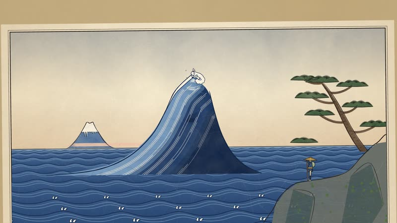</a><br><b>Ukiyo-e</b> · 浮世绘<br><i>A Journey Toward the Mountain</i><br><sub>A traveller walks toward a distant mountain; every shot is a woodblock print, ending in a great wave.<br>旅人走向远山，每个镜头都是一幅版画，最后迎来一道巨浪。</sub></td>
<td width="33%" valign="top"><a href="styles/papercut-red/STYLE.md">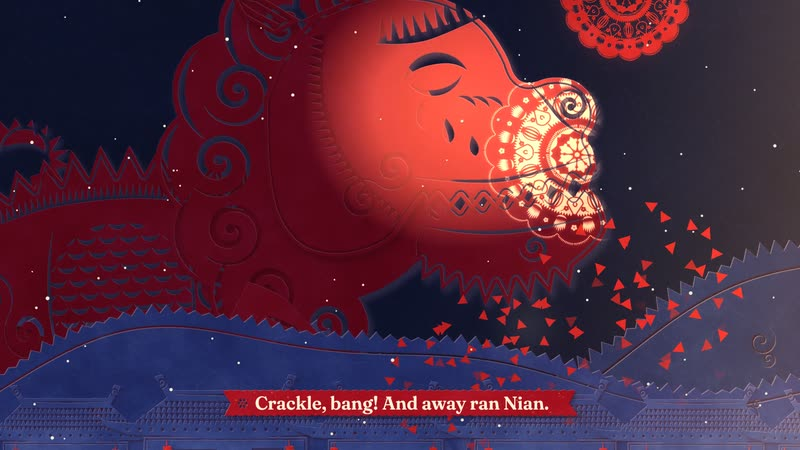</a><br><b>Red Paper-cut</b> · 红色窗花剪纸<br><i>Nian Comes to Town</i><br><sub>On New Year&#x27;s Eve the beast Nian comes to town, and one girl&#x27;s giant paper-cut lights up the village to scare it off.<br>除夕年兽进村，小女孩剪出的大窗花照亮全村，把它吓跑。</sub></td>
</tr>
<tr>
<td width="33%" valign="top"><a href="styles/paper-lantern/STYLE.md">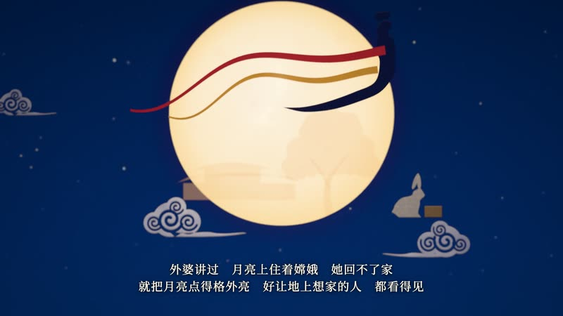</a><br><b>Paper-cut Lightbox</b> · 纸雕灯影<br><i>A Mooncake&#x27;s Longing</i><br><sub>A single mooncake tells the Mid-Autumn story of reunion and longing inside a glowing paper-cut lightbox.<br>一枚月饼讲中秋的团圆与思念，纸雕灯箱层层透光。</sub></td>
<td width="33%" valign="top"><a href="styles/blue-white/STYLE.md">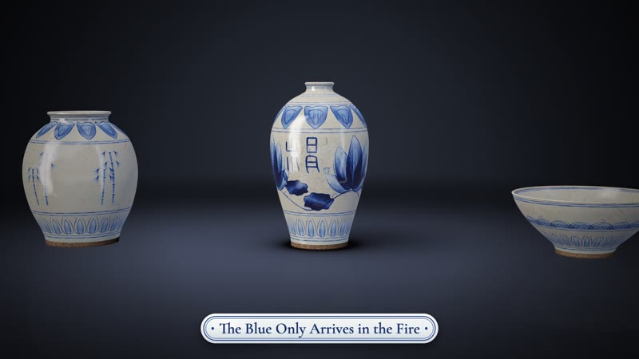</a><br><sup><b>★ Added here · 本仓库新增</b></sup><br><b>Blue-and-White Porcelain</b> · 青花瓷<br><i>The Blue Only Arrives in the Fire</i><br><sub>A brush paints a river round a turning vase, the camera falls through its rim into the painted landscape, and the kiln turns grey strokes to blue.<br>一支笔在转动的瓷瓶上画出一条河，镜头从瓶口落进画里的山水，入窑一烧，灰色笔痕变成青蓝。</sub></td>
<td width="33%" valign="top"><a href="styles/dunhuang/STYLE.md">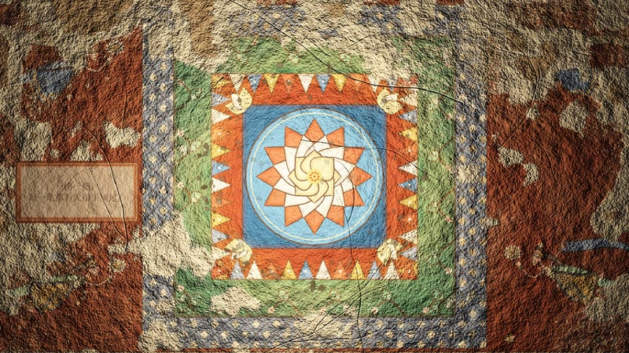</a><br><sup><b>★ Added here · 本仓库新增</b></sup><br><b>Dunhuang Mural</b> · 敦煌壁画<br><i>Borrowed Lamplight</i><br><sub>A borrowed oil lamp walks along a cave wall; every register it passes wakes from weathered plaster to its first colour, and when the flame sinks the wall remembers.<br>借来的一盏油灯沿着洞窟墙壁走过，灯光所到之处，褪色的壁画一层层醒回最初的颜色；火苗落下时，墙还记得。</sub></td>
</tr>
<tr>
<td width="33%" valign="top"><a href="styles/lacquer-gold/STYLE.md">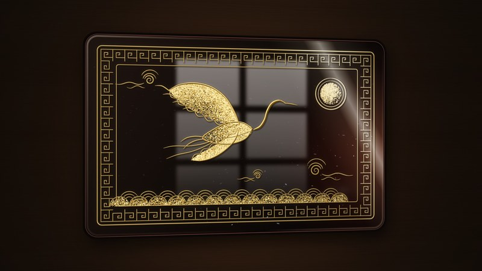</a><br><sup><b>★ Added here · 本仓库新增</b></sup><br><b>Lacquer &amp; Gold</b> · 漆器描金<br><i>Thirty Coats</i><br><sub>A lid takes thirty coats of lacquer, each cured in damp air and polished, before the first gold line is drawn; then it turns in the light, opens, and shows the red that was under everything.<br>一只漆盒盖上了三十道漆，每一道都要在潮气里阴干、打磨；直到最后才落下第一笔描金，盒盖在光里转动、掀开，里面是一直垫在底下的朱红。</sub></td>
<td width="33%" valign="top"><a href="styles/nianhua/STYLE.md">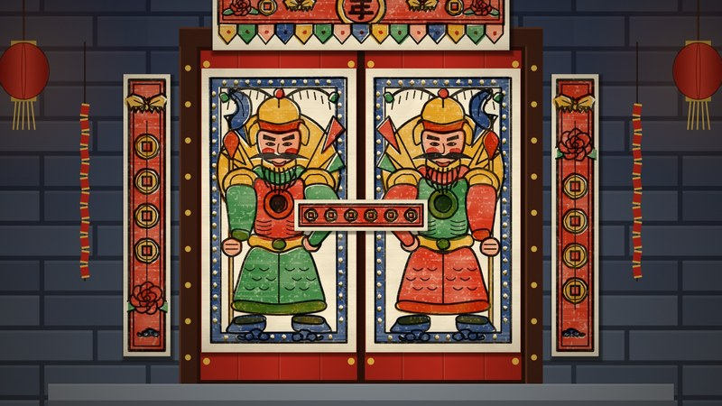</a><br><sup><b>★ Added here · 本仓库新增</b></sup><br><b>Woodblock New Year Print</b> · 木版年画<br><i>Five Blocks to a Door</i><br><sub>A carved plank prints a child with a carp and a lotus, one colour block at a time; pasted on a door with a mirrored guardian pair, the old year tears when the door opens, and the plank stays on the bench.<br>一块雕好的木板印出抱鲤鱼、举莲花的娃娃，一版一色叠印而成；贴上大门配成对称的门神，门一开旧年的纸被撕开，留下的是工作台上的那块板。</sub></td>
</tr>
</table>

### Print & Printmaking · 印刷与版画

<table>
<tr>
<td width="33%" valign="top"><a href="styles/risograph/STYLE.md">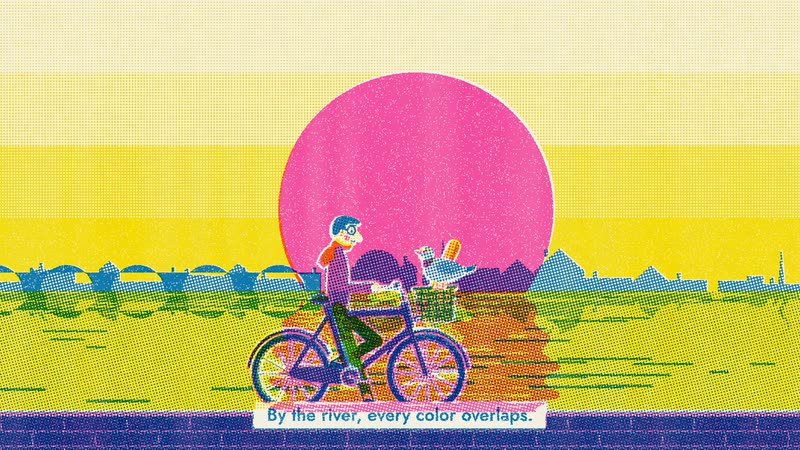</a><br><b>Risograph Print</b> · Risograph 丝网印刷<br><i>Sunday Ride</i><br><sub>A Sunday-morning bike ride through the city — bakery, park, riverside — in two misregistered inks.<br>周日早晨骑车穿过城市：面包店、公园、河边。</sub></td>
<td width="33%" valign="top"><a href="styles/halftone-dossier/STYLE.md">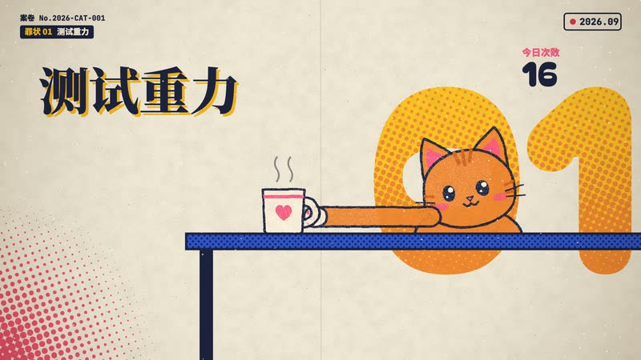</a><br><b>Halftone Dossier</b> · 复古半调案卷<br><i>Case File: Chubby</i><br><sub>A chubby orange cat stands trial for testing gravity and 4 a.m. parkour, and walks free.<br>橘猫胖橘被立案审查：测试重力、凌晨跑酷，最后无罪释放。</sub></td>
<td width="33%" valign="top"><a href="styles/woodcut/STYLE.md">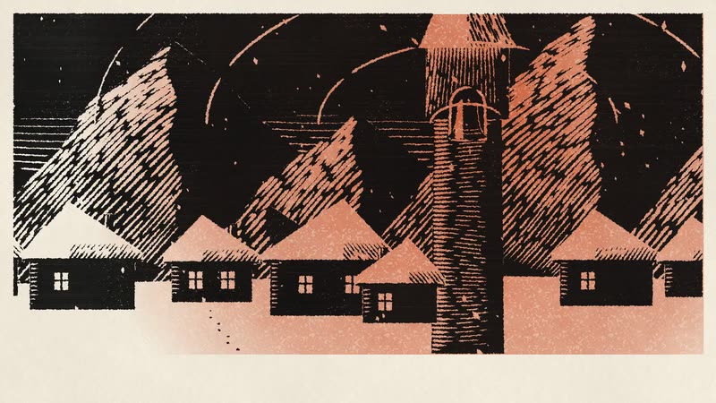</a><br><b>Woodcut Print</b> · 木刻版画<br><i>The Bell Founder</i><br><sub>A village spends a whole winter casting one bell; the first time it rings, the snow stops.<br>村子用一整个冬天铸一口钟，钟声第一次响起，雪停了。</sub></td>
</tr>
<tr>
<td width="33%" valign="top"><a href="styles/engraving/STYLE.md">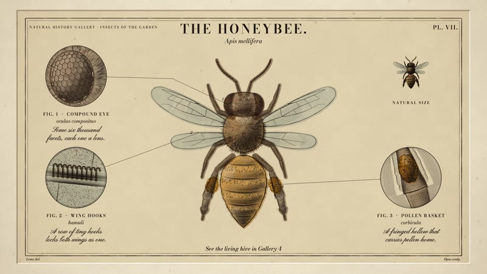</a><br><b>Copperplate Engraving</b> · 铜版画<br><i>The Honeybee, Plate VII</i><br><sub>A natural-history plate engraves itself: the burin cuts the copper, the bee builds up line by line, and a watercolour wash brings it to life.<br>一张博物志图版自己刻出来：雕刀推开铜版，蜜蜂一线线成形，最后手工水彩上色。</sub></td>
<td width="33%" valign="top"><a href="styles/silkscreen-poster/STYLE.md">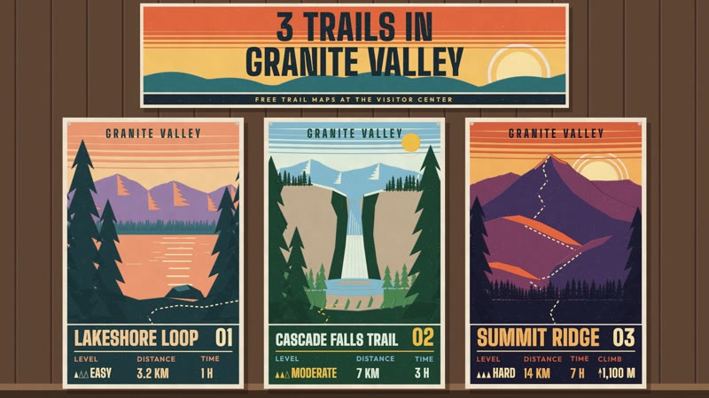</a><br><b>Silkscreen Travel Poster</b> · 丝印旅行海报<br><i>Three Trails</i><br><sub>Three trail posters are screen-printed one ink at a time, then climbed in one long take from noon to dusk.<br>三条步道各一张丝印海报，一色一刮印出来，再沿山脊一镜到底从正午爬到黄昏。</sub></td>
<td width="33%" valign="top"><a href="styles/natural-history/STYLE.md">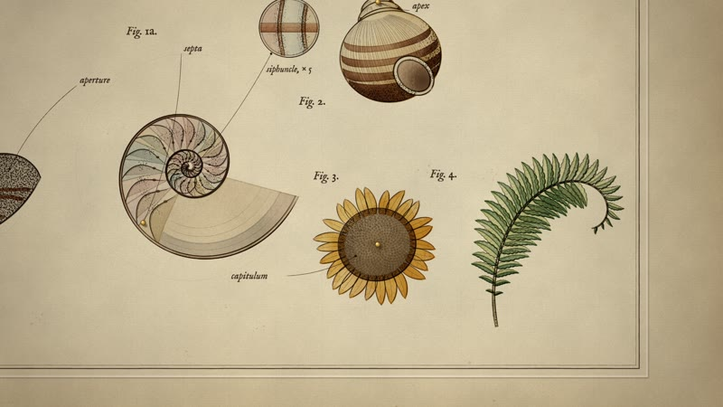</a><br><sup><b>★ Added here · 本仓库新增</b></sup><br><b>Natural History Plate</b> · 博物图鉴<br><i>Plate IV: The Spiral, in Four Makers</i><br><sub>A blank sheet fills with a hand-coloured plate: a chambered shell is drawn, halved and magnified, then a snail, a sunflower head and a fern crozier join it, each pinned, until the page curls away.<br>一张空白图版被一笔笔画满：鹦鹉螺先被画出、剖开、放大，随后蜗牛、向日葵花盘和蕨类拳卷幼叶依次画好并钉住，最后整页被翻走。</sub></td>
</tr>
<tr>
<td width="33%" valign="top"><a href="styles/newsprint/STYLE.md">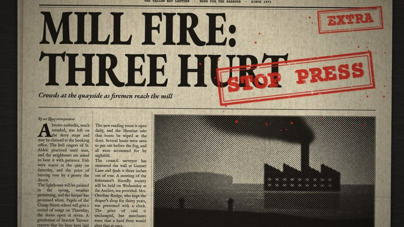</a><br><sup><b>★ Added here · 本仓库新增</b></sup><br><b>Letterpress Newspaper</b> · 活字报纸头版<br><i>Print It True</i><br><sub>A small-town paper prints a fire that never happened; a stop-press stamp pulls the headline out letter by letter, the halftone photograph re-develops, and the correction is set as large as the mistake.<br>小镇报纸头版登出一场并不存在的火灾；“停机”印章一盖，标题活字被逐个抽出，网点照片重新显影，更正启事排得和错误标题一样大。</sub></td>
<td width="33%" valign="top"><a href="styles/tarot/STYLE.md">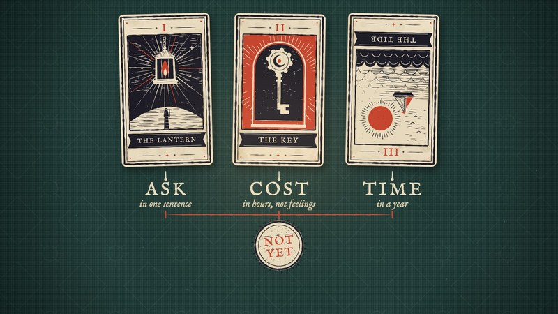</a><br><sup><b>★ Added here · 本仓库新增</b></sup><br><b>Tarot Cards</b> · 塔罗牌<br><i>Three Cards for a Yes</i><br><sub>A favour is asked and yes is already forming; a shuffled deck deals three cards, a Lantern for what is asked, a Key for what it costs, a Tide for whether it matters in a year, and the last one lands upside down: not yet.<br>有人请你帮个忙，“好”字已到嘴边；洗牌、切牌、发三张：灯笼问到底要你做什么，钥匙问代价是什么，潮汐问一年后还重要吗，最后一张倒位落下：先不急着答应。</sub></td>
<td width="33%" valign="top"><a href="styles/cyanotype/STYLE.md">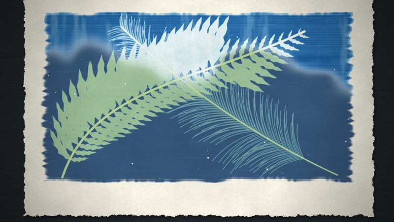</a><br><sup><b>★ Added here · 本仓库新增</b></sup><br><b>Cyanotype</b> · 蓝晒<br><i>Reading the Sun</i><br><sub>A strip of sun-sensitive paper is uncovered one band at a time, the wash shows which exposure keeps its whites, and a fern and a feather are printed with exactly that much sun.<br>一条涂了感光液的纸条被一段一段揭开，水洗后只有一段留住了白；蕨叶和羽毛就按那一段的曝光时间印出来。</sub></td>
</tr>
</table>

### Graphic & Type · 图形与排版

<table>
<tr>
<td width="33%" valign="top"><a href="styles/swiss-motion/STYLE.md">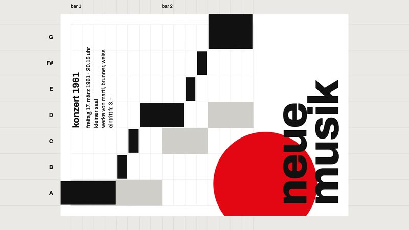</a><br><b>Swiss Motion Graphics</b> · 瑞士动态排版<br><i>Five Rules for a Poster</i><br><sub>A concert poster lays itself out by five Swiss design rules; the fifth is to break just one.<br>一张音乐会海报按瑞士设计的五条规则自己排版，第五条是只打破一条。</sub></td>
<td width="33%" valign="top"><a href="styles/spy-titles/STYLE.md">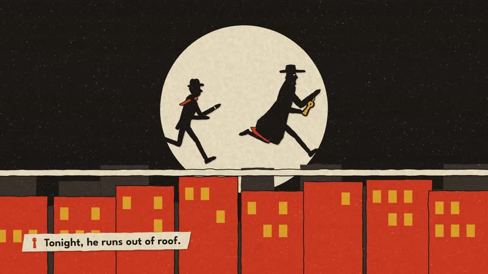</a><br><b>60s Spy Title Sequence</b> · 60s 间谍片头<br><i>The Velvet Cipher</i><br><sub>Opening titles for an imaginary 1964 spy film: a chase for a stolen key until the shapes lock into the title.<br>虚构 1964 年间谍片的片头：追一把被偷的钥匙，几何碎片最后拼成片名。</sub></td>
<td width="33%" valign="top"><a href="styles/art-deco/STYLE.md">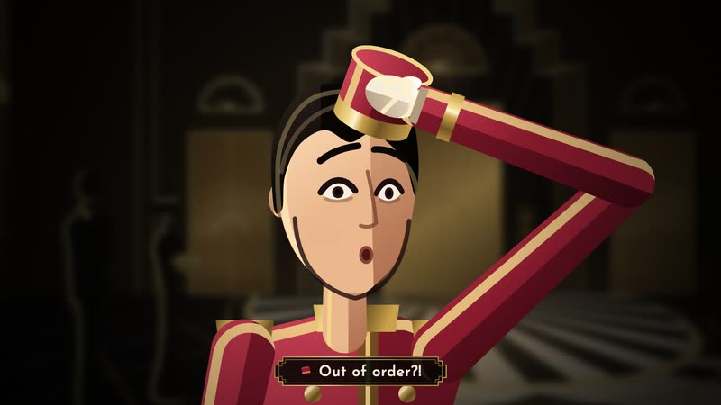</a><br><b>Art Deco</b> · 装饰艺术<br><i>Midnight at the Starlight Hotel</i><br><sub>A grand hotel, 1930: a bellboy races lifts and revolving doors to deliver one letter before midnight.<br>1930 年的大饭店，门童赶在午夜前把一封信送上顶楼。</sub></td>
</tr>
<tr>
<td width="33%" valign="top"><a href="styles/blueprint/STYLE.md">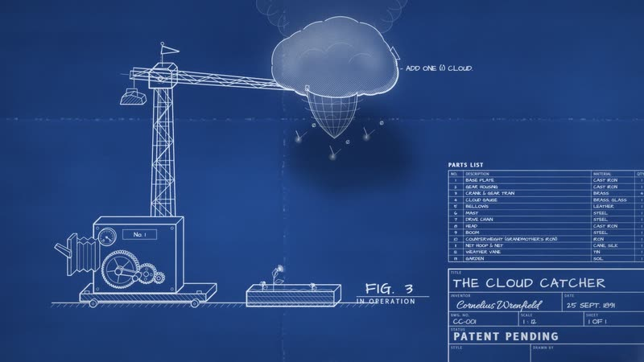</a><br><b>Blueprint</b> · 蓝图 / 工程制图<br><i>Patent Pending: The Cloud Catcher</i><br><sub>An inventor&#x27;s blueprint draws, explodes and assembles a cloud-catching machine, and its revision cloud starts to rain.<br>发明家的蓝图自己画出一台接云机器，修订云线变成了真的雨云。</sub></td>
<td width="33%" valign="top"><a href="styles/stained-glass/STYLE.md">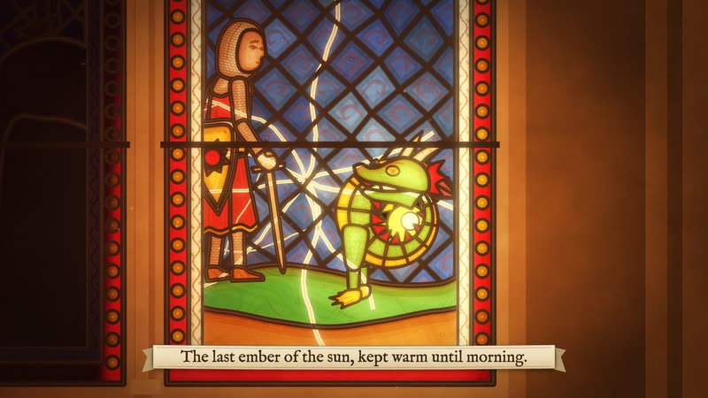</a><br><b>Stained Glass</b> · 彩色玻璃窗<br><i>The Dragon of the East Window</i><br><sub>Sunlight crosses a cathedral window from dawn to dusk, waking each pane of a knight-and-dragon tale.<br>阳光从清晨移到黄昏，照到哪一格花窗，哪一格的故事就动起来。</sub></td>
<td width="33%" valign="top"><a href="styles/pictogram-motion/STYLE.md">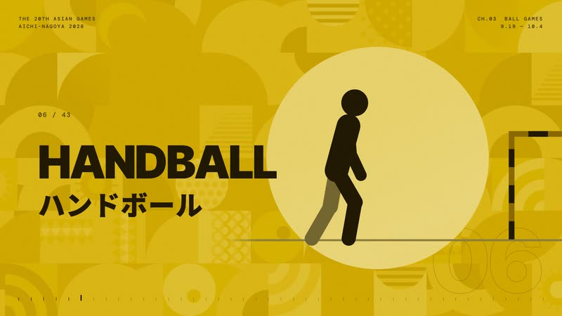</a><br><b>Pictogram Motion</b> · 象形运动图形<br><i>Aichi-Nagoya 2026 — All 43 Sports</i><br><sub>All 43 sports of the 2026 Asian Games as beat-locked geometric pictograms.<br>2026 亚运会 43 个大项，几何象形人卡着节拍快闪。</sub></td>
</tr>
<tr>
<td width="33%" valign="top"><a href="styles/ascii-crt/STYLE.md">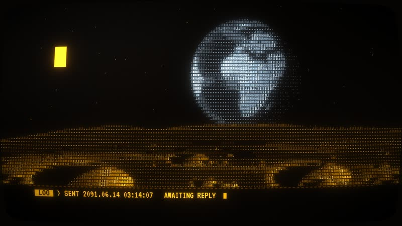</a><br><b>ASCII / CRT Terminal</b> · ASCII / CRT 终端<br><i>Tranquility.log</i><br><sub>A moon-base AI wakes after forty years to a signal from Earth, and replies by drawing “home” in characters.<br>月球基地的 AI 沉睡 40 年后被唤醒，用字符画出“家”来回复。</sub></td>
<td width="33%" valign="top"><a href="styles/neon-sign/STYLE.md">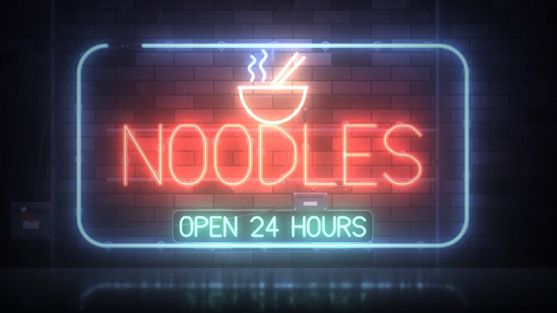</a><br><sup><b>★ Added here · 本仓库新增</b></sup><br><b>Neon Signage</b> · 霓虹灯牌<br><i>The Last Bowl on Pell Street</i><br><sub>A noodle bar&#x27;s neon sign is lit tube by tube at dusk, loses one stroke of a letter in the small hours, and is switched off to grey glass at dawn.<br>一家面馆的霓虹灯牌被一根根点亮，后半夜一个字母的笔画永远熄了，天亮时被一只手拉闸，只剩灰色的玻璃管。</sub></td>
<td width="33%" valign="top"><a href="styles/art-nouveau/STYLE.md">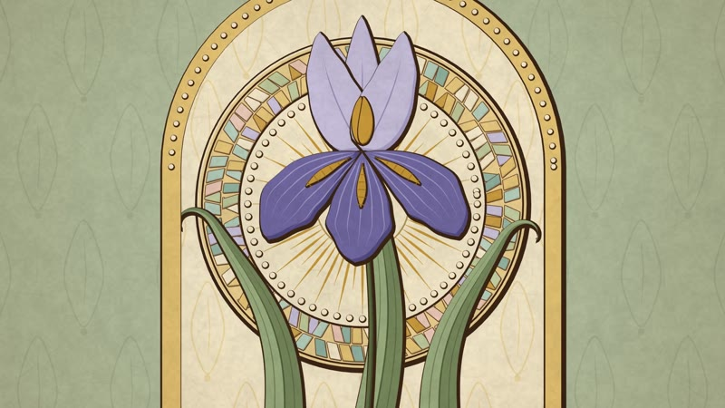</a><br><sup><b>★ Added here · 本仓库新增</b></sup><br><b>Art Nouveau</b> · 新艺术<br><i>The Iris Hour</i><br><sub>A single gilded line becomes a vine that carries us past three arched windows, from a frosted bud to an iris in bloom, and the title is lettered out of its stem.<br>一根鎏金的线变成藤蔓，带我们穿过三扇拱窗，从结霜的花苞走到盛开的鸢尾，片名就从花茎里写出来。</sub></td>
</tr>
<tr>
<td width="33%" valign="top"><a href="styles/constructivist/STYLE.md">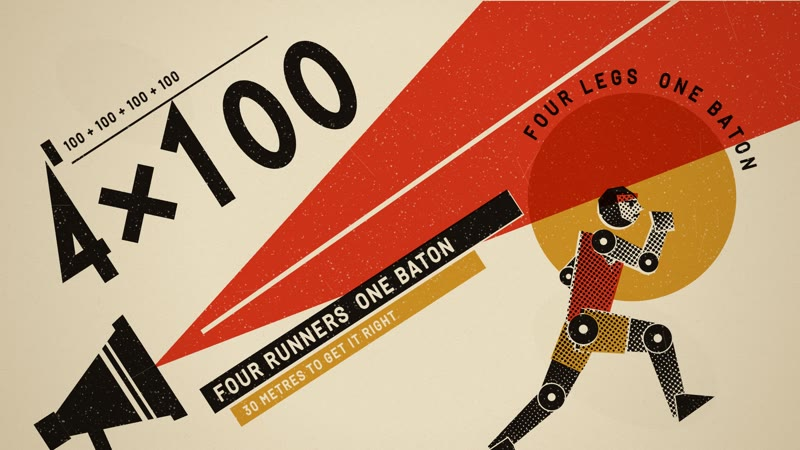</a><br><sup><b>★ Added here · 本仓库新增</b></sup><br><b>Bauhaus &amp; Constructivist Poster</b> · 包豪斯构成主义<br><i>Thirty Metres</i><br><sub>A relay poster builds itself block by block on a steep diagonal, and the whole film narrows to the one place a race is won: the thirty-metre box where the baton changes hands.<br>一张接力赛海报沿陡峭的对角线一块一块搭起来，整部片子收窄到决定胜负的那 30 米交接区：接力棒在这里换手。</sub></td>
<td width="33%" valign="top"><a href="styles/y2k-vaporwave/STYLE.md">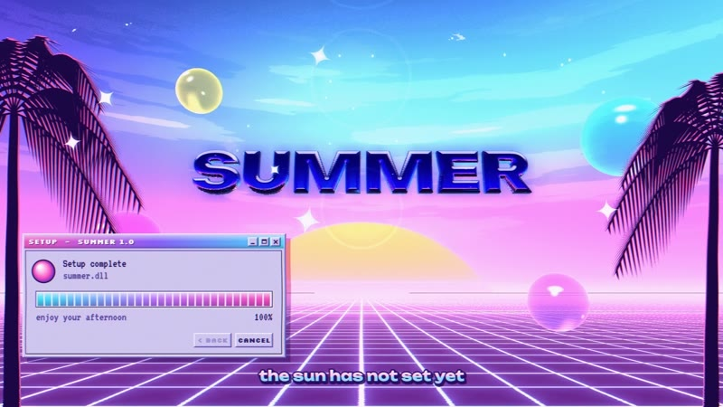</a><br><sup><b>★ Added here · 本仓库新增</b></sup><br><b>Vaporwave &amp; Y2K Chrome</b> · 蒸汽波与 Y2K<br><i>Installing Summer</i><br><sub>A setup wizard installs one summer: the bar crawls under a sinking banded sun, hangs at 99 % in silence, then completes in spinning chrome type before the last dialog is dismissed.<br>一个安装向导在安装一个夏天：进度条在沉落的条纹夕阳下爬行，静默中卡在 99%，然后以旋转的铬金属字完成，最后点掉最后一个对话框。</sub></td>
<td width="33%" valign="top"><a href="styles/transit-map/STYLE.md">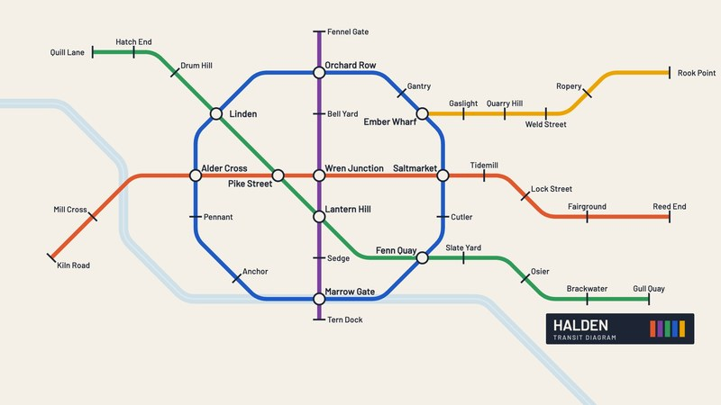</a><br><sup><b>★ Added here · 本仓库新增</b></sup><br><b>Transit Map</b> · 地铁线路图<br><i>Three Angles to Anywhere</i><br><sub>A traveller lost in the curved tangle of an invented city watches its map straighten onto three angles, learns the rules from the legend, and rides two changes to a lantern festival.<br>一位旅客迷失在虚构城市弯曲的线路里；地图在眼前被拉直到三种角度，图例讲完规则，他换乘两次，抵达灯笼节。</sub></td>
</tr>
<tr>
<td width="33%" valign="top"><a href="styles/split-flap/STYLE.md">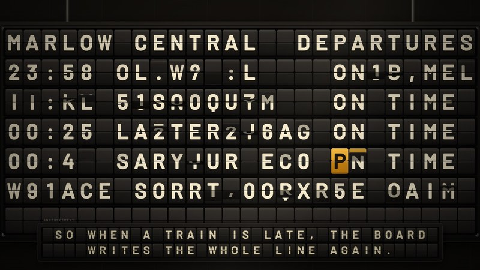</a><br><sup><b>★ Added here · 本仓库新增</b></sup><br><b>Split-flap Board</b> · 翻牌显示屏<br><i>The Long Way Round</i><br><sub>A night-station departure board can only turn forward: going back from B to A costs thirty-nine flaps, so a delay rewrites a whole line, a countdown ticks on a ten-flap wheel, and a last sentence is spelled cell by cell.<br>夜间车站的翻牌显示屏只能向前翻：从 B 退回 A 要翻三十九张牌，所以一次晚点会让整行重写，倒计时在十张牌的数字轮上跳动，最后一句话一格一格拼出来。</sub></td>
<td width="33%" valign="top"><a href="styles/vector-scope/STYLE.md">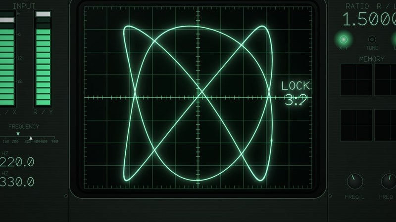</a><br><sup><b>★ Added here · 本仓库新增</b></sup><br><b>Vector Oscilloscope</b> · 矢量示波器<br><i>Hold the Fifth</i><br><sub>Two tones drift toward a simple ratio until the picture they draw stands still; then the score itself writes a word on the glass.<br>两个音渐渐靠近一个简单的比例，它们画出的图形终于静止；最后由配乐本身在荧光屏上写出一个词。</sub></td>
</tr>
</table>

### Information & Keynote · 信息与发布

<table>
<tr>
<td width="33%" valign="top"><a href="styles/dataviz/STYLE.md">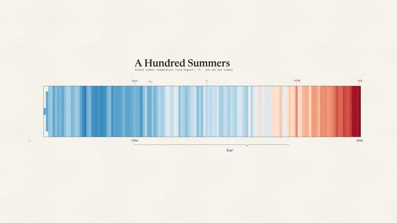</a><br><b>Data Storytelling</b> · 数据叙事<br><i>A Hundred Summers</i><br><sub>A hundred years of summer temperatures, where the chart itself tells the story.<br>一百年的夏季气温，图表本身就是故事。</sub></td>
<td width="33%" valign="top"><a href="styles/iso-infographic/STYLE.md"></a><br><b>Isometric Infographic</b> · 等距信息图<br><i>From Bean to Cup</i><br><sub>A coffee&#x27;s journey from the plantation to your hands, across one isometric world.<br>一杯咖啡从种植园到你手里的旅程。</sub></td>
<td width="33%" valign="top"><a href="styles/dark-keynote/STYLE.md">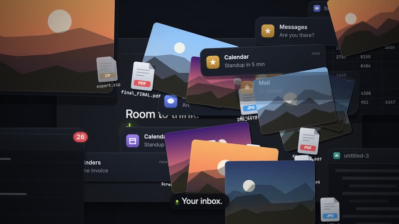</a><br><b>Dark Tech Keynote</b> · 暗色科技发布<br><i>Room to Think</i><br><sub>Launch film for Tidy, a fictional app: one buried cursor snaps hundreds of windows back into place.<br>虚构 app Tidy 的发布片：被埋掉的光标一键把几百个窗口归位。</sub></td>
</tr>
<tr>
<td width="33%" valign="top"><a href="styles/living-screencast/STYLE.md">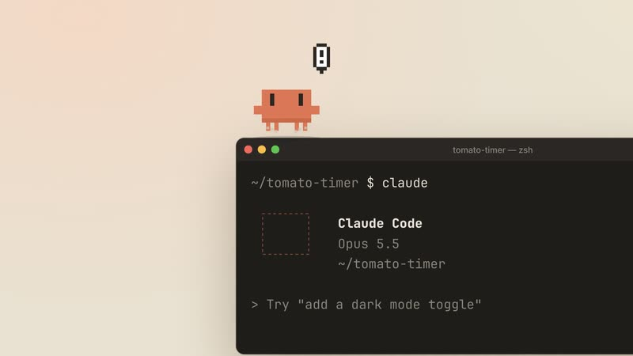</a><br><b>Living Screencast</b> · 活体实机录屏<br><i>Clawd Moves In</i><br><sub>Clawd, the Claude Code pixel mascot, hops out of the terminal into the Claude app and acts out plan mode, diff comments and self-checks in a one-take screencast.<br>像素小人 Clawd 跳出终端、搬进 Claude 应用，在一镜到底的录屏里演示 Plan 模式、diff 评论和自检。</sub></td>
<td width="33%" valign="top"><a href="styles/hologram-hud/STYLE.md">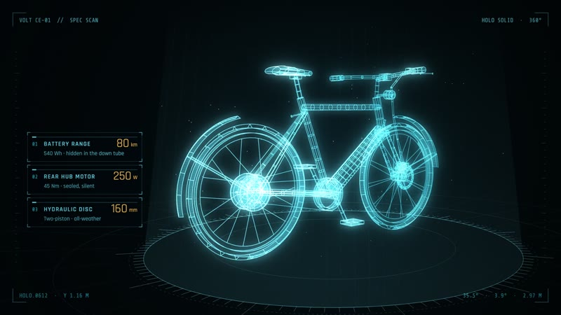</a><br><b>Sci-fi Hologram HUD</b> · 科幻全息界面<br><i>Volt · Spec Scan</i><br><sub>An e-bike is scanned into a hologram; target boxes lock onto the battery, motor and brakes, and each spec rolls into place.<br>一辆电助力车被扫描成全息线框，目标框依次锁定电池、电机、刹车，参数逐个滚到真值。</sub></td>
<td width="33%" valign="top"><a href="styles/sheet-music/STYLE.md">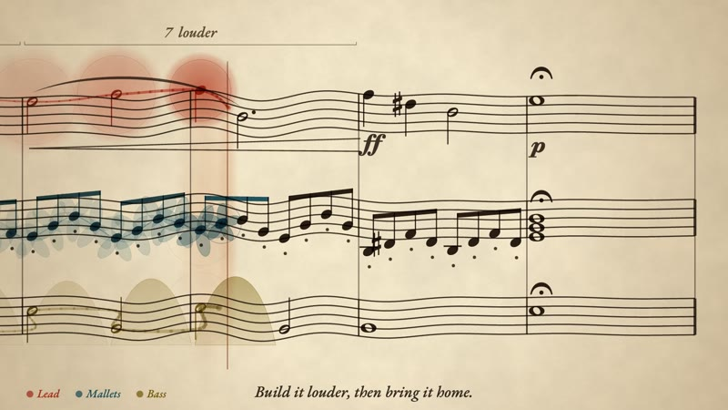</a><br><sup><b>★ Added here · 本仓库新增</b></sup><br><b>Sheet-music Motion</b> · 乐谱音乐可视化<br><i>Four Notes</i><br><sub>A four-note seed is repeated, mirrored and stretched on an engraved page, then the page unrolls into a landscape where the same score blooms, ripples and draws itself as ribbons.<br>四个音符的动机被重复、倒影、拉长；乐谱随后铺开成风景，同一份乐谱开花、起浪、画出旋律的丝带。</sub></td>
</tr>
<tr>
<td width="33%" valign="top"><a href="styles/chat-log/STYLE.md">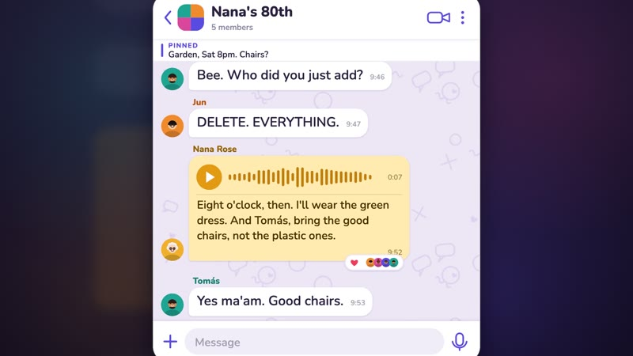</a><br><sup><b>★ Added here · 本仓库新增</b></sup><br><b>Chat Log</b> · 聊天记录体<br><i>She Knows</i><br><sub>A family group chat plans a surprise party, adds the birthday woman by mistake, recalls everything in a panic, and waits through her typing dots for a voice message that turns the secret around.<br>一个家庭群在筹备惊喜生日会，误把寿星拉进了群，大家慌忙撤回，对着她“正在输入…”的圆点干等，直到一条语音把秘密整个翻了过来。</sub></td>
<td width="33%" valign="top"><a href="styles/danmaku/STYLE.md">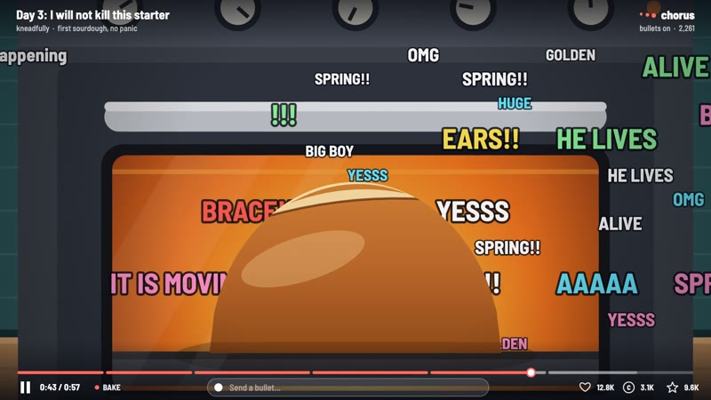</a><br><sup><b>★ Added here · 本仓库新增</b></sup><br><b>Danmaku Comments</b> · 弹幕体<br><i>Day 3: I will not kill this starter</i><br><sub>A first sourdough watched through a video player whose scrolling bullet comments are the narrator, the chorus and the joke-teller: doubt turns to coaching, the crowd falls asleep over the proof, a wall of reactions rises with the loaf, and a pause freezes the whole crowd in mid-air.<br>透过一个视频播放器看第一次做酸面包：滚动的弹幕同时是旁白、合唱和段子手。质疑变成指导，醒面时全场睡着，面包胀起时反应刷成一面墙，暂停让整屏弹幕悬在半空。</sub></td>
</tr>
</table>

### Cartoon & Anime · 卡通与动画

<table>
<tr>
<td width="33%" valign="top"><a href="styles/rubber-hose/STYLE.md">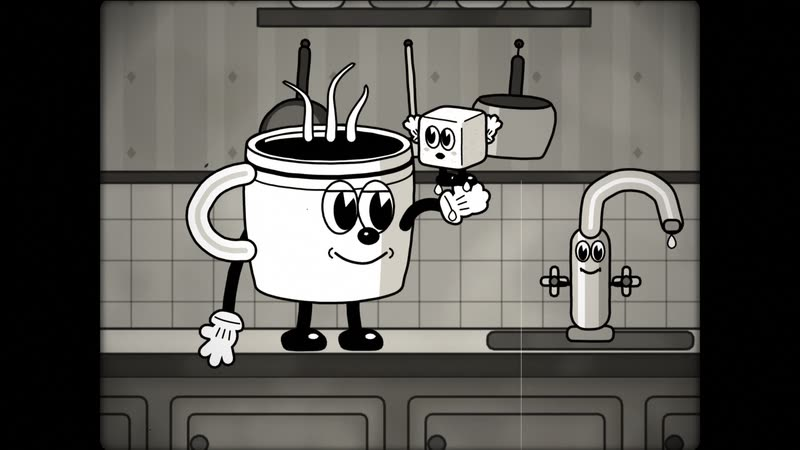</a><br><b>1930s Rubber Hose Cartoon</b> · 1930s 橡皮管卡通<br><i>Coffee Cup Chase</i><br><sub>A coffee cup chases a runaway sugar cube around the kitchen, 1930s-cartoon style.<br>一只咖啡杯满厨房追一块逃跑的方糖。</sub></td>
<td width="33%" valign="top"><a href="styles/cel-anime-80s/STYLE.md">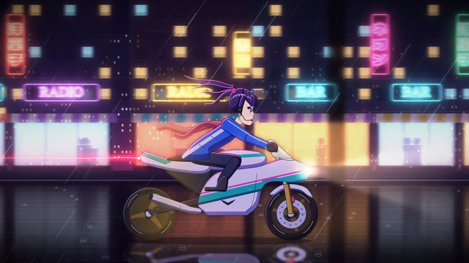</a><br><b>80s Cel Anime</b> · 80 年代赛璐璐动画<br><i>City Lights, 1987</i><br><sub>A courier girl rides through a rain-soaked neon city to deliver a tape before the dawn launch.<br>快递少女骑车穿过雨后霓虹都市，赶在黎明发射前送到一盘磁带。</sub></td>
<td width="33%" valign="top"><a href="styles/scifi-toon/STYLE.md">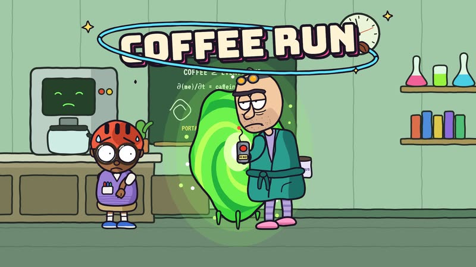</a><br><b>Sci-Fi Sitcom Toon</b> · 科幻情景喜剧卡通<br><i>Coffee Run</i><br><sub>A jaded genius opens a portal just to buy coffee and tumbles through ever-stranger universes.<br>厌世天才开传送门只想买杯咖啡，却穿过越来越离谱的平行宇宙。</sub></td>
</tr>
<tr>
<td width="33%" valign="top"><a href="styles/midcentury-toon/STYLE.md">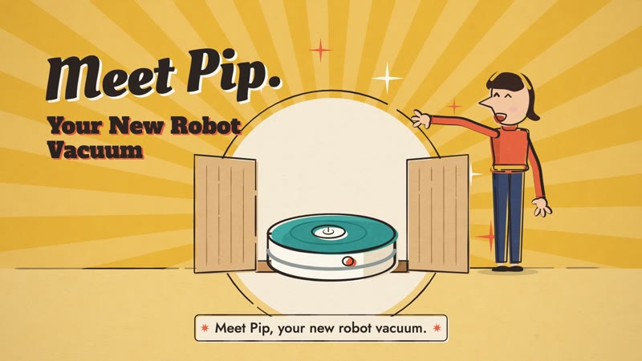</a><br><b>Mid-century Cartoon</b> · 50s 扁平卡通<br><i>Meet Pip</i><br><sub>A robot vacuum set up in three steps, told like a 1950s classroom film: place the dock, connect the app, press start.<br>用 50 年代教育片的口吻，三步教你装好一台扫地机：放充电座、连 app、按开始。</sub></td>
<td width="33%" valign="top"><a href="styles/comic-pop/STYLE.md">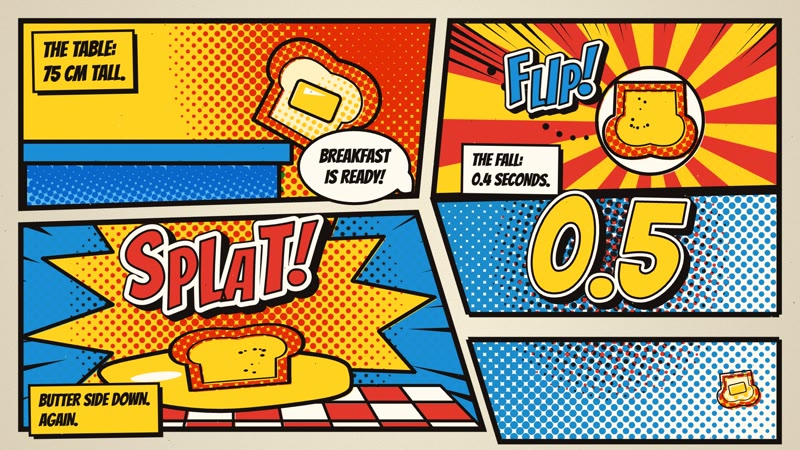</a><br><sup><b>★ Added here · 本仓库新增</b></sup><br><b>Comic Panel Pop Art</b> · 美漫分格波普<br><i>Butter Side Down</i><br><sub>A slice of toast slides off a 75 cm table, gets exactly half a spin, and lands butter side down: the physics of Murphy&#x27;s law in a comic page that builds itself panel by panel.<br>一片吐司从 75 厘米高的桌边滑落，只来得及转半圈，黄油面朝下：墨菲定律背后的物理，用一页自己拼起来的美漫。</sub></td>
<td width="33%" valign="top"><a href="styles/opera-cel/STYLE.md">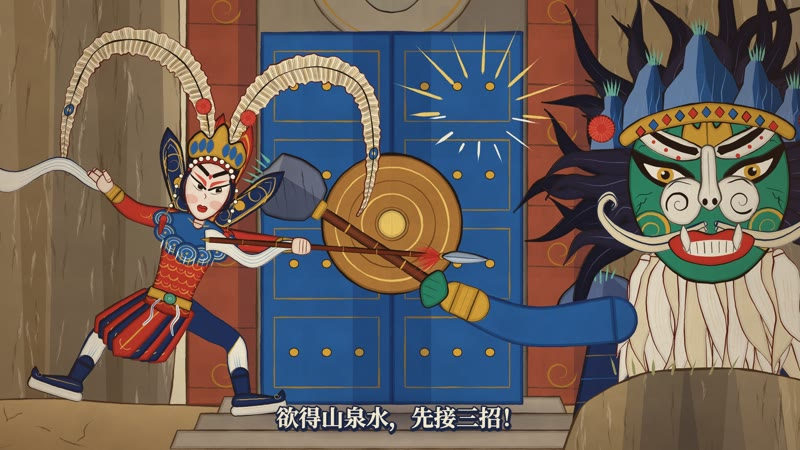</a><br><sup><b>★ Added here · 本仓库新增</b></sup><br><b>Peking Opera Cel Animation</b> · 国风戏曲动画<br><i>One Gong at Stone Gate</i><br><sub>A young stage-warrior duels a stone spirit at a mountain gate, then opens the shut spring with one struck gong instead of her spear.<br>年轻的武旦与石精在山门对阵，最后没有出枪，只敲了一记锣，封住的泉水便涌了出来。</sub></td>
</tr>
<tr>
<td width="33%" valign="top"><a href="styles/manga-panel/STYLE.md">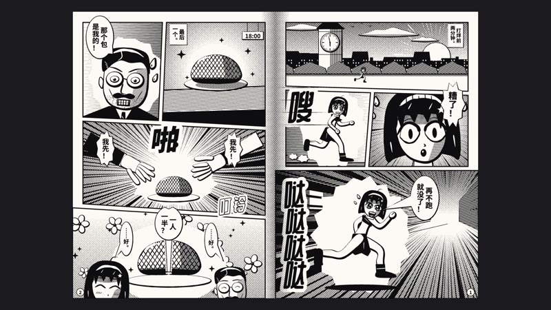</a><br><sup><b>★ Added here · 本仓库新增</b></sup><br><b>Manga Panel</b> · 漫画黑白网点<br><i>The Last Pineapple Bun</i><br><sub>A girl and a middle-aged salaryman sprint for the last pineapple bun of the day, reach it in the same second, and split it: a black-and-white manga spread read right to left, panel by panel.<br>女孩和中年上班族为当天最后一个菠萝包冲刺，同一秒伸手，最后一人一半：一页从右往左、一格一格读下去的黑白漫画。</sub></td>
</tr>
</table>

### Games · 游戏

<table>
<tr>
<td width="33%" valign="top"><a href="styles/pixel-rpg/STYLE.md">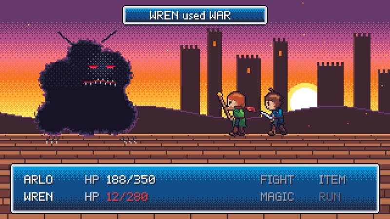</a><br><b>16-bit Pixel RPG</b> · 16-bit 像素 RPG<br><i>The Last Save Point</i><br><sub>At the final boss door a hero saves the game, and the save screen replays the whole journey.<br>勇士在最终 Boss 门前存档，存档画面闪回一路冒险。</sub></td>
<td width="33%" valign="top"><a href="styles/hd-2d/STYLE.md">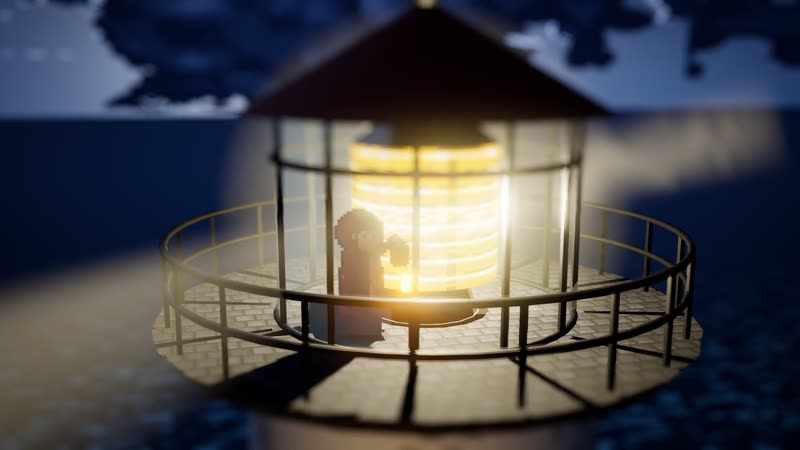</a><br><b>HD-2D</b><br><i>The Lampbearer</i><br><sub>The lighthouse goes dark; a girl carries the last flame through a night forest and up the storm cliffs.<br>灯塔熄灭，孙女提着最后一簇火穿过夜林、爬上风暴悬崖。</sub></td>
<td width="33%" valign="top"><a href="styles/microgame/STYLE.md">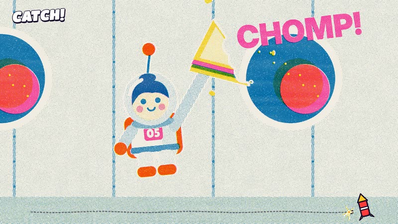</a><br><b>Microgame Frenzy</b> · 微游戏快闪（瓦里奥制造式）<br><i>Five-Second Astronaut</i><br><sub>A clumsy cadet survives a five-second boot camp, faster and faster, until the boss: landing home.<br>见习宇航员闯五秒训练营，越来越快，Boss 关亲手降落回地球。</sub></td>
</tr>
<tr>
<td width="33%" valign="top"><a href="styles/game-show/STYLE.md">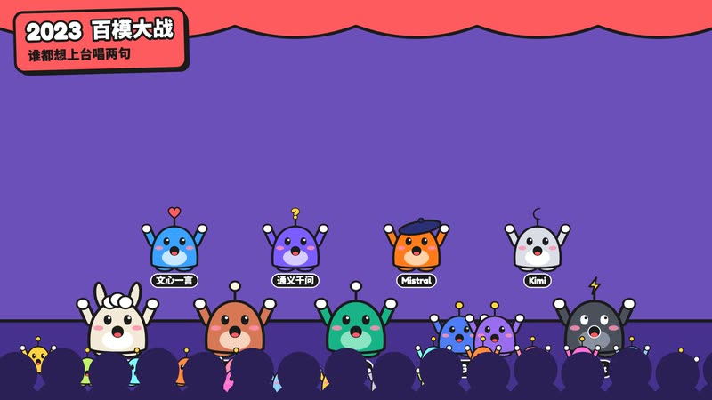</a><br><b>Game Show Flat</b> · 综艺节奏扁平<br><i>Rhythm of AI, 1997 → 2026</i><br><sub>The history of AI as a rhythm game: models take the stage on the beat, and a report card closes the show.<br>把 AI 发展史做成一局节奏游戏，模型踩着拍登场，最后发成绩单。</sub></td>
<td width="33%" valign="top"><a href="styles/pixel-8bit/STYLE.md">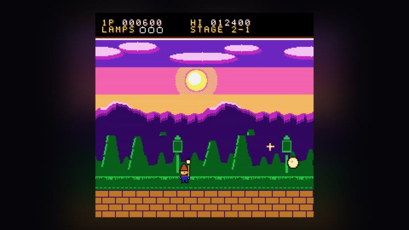</a><br><sup><b>★ Added here · 本仓库新增</b></sup><br><b>8-bit Console Pixel</b> · 8-bit 红白机像素<br><i>Dusklight</i><br><sub>Wick the lamplighter races the dusk through two scrolling stages, climbs a beacon tower, lights it through a moth swarm that overloads the sprite hardware, and sets a new high score.<br>提灯人 Wick 在两段横版关卡里和黄昏赛跑，爬上灯塔，穿过让精灵硬件超载闪烁的飞蛾群点亮它，刷新最高分。</sub></td>
</tr>
</table>

### Cinema & Eras · 电影与时代

<table>
<tr>
<td width="33%" valign="top"><a href="styles/silent-film/STYLE.md">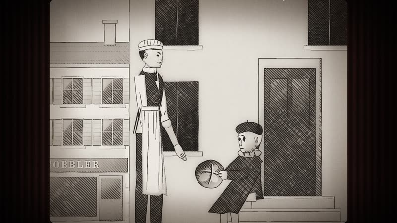</a><br><b>1920s Silent Film</b> · 1920s 默片<br><i>The Runaway Loaf</i><br><sub>A baker&#x27;s boy chases a runaway loaf downhill, then breaks it in half for a hungry girl.<br>面包店学徒追一个滚走的面包，最后掰成两半分给饿肚子的小女孩。</sub></td>
<td width="33%" valign="top"><a href="styles/backrooms/STYLE.md">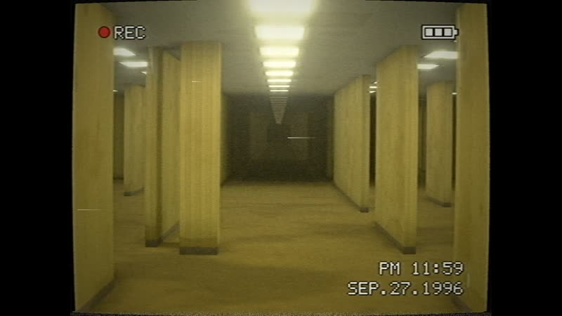</a><br><b>Liminal Found Footage</b> · 后室 / 新怪谈<br><i>Night Shift Orientation</i><br><sub>A new night-shift hire films their first night in an endless yellow office, following the rules on the wall.<br>新夜班员工拍下入职第一晚：无尽的黄色办公空间，和墙上的员工守则。</sub></td>
<td width="33%" valign="top"><a href="styles/super8/STYLE.md">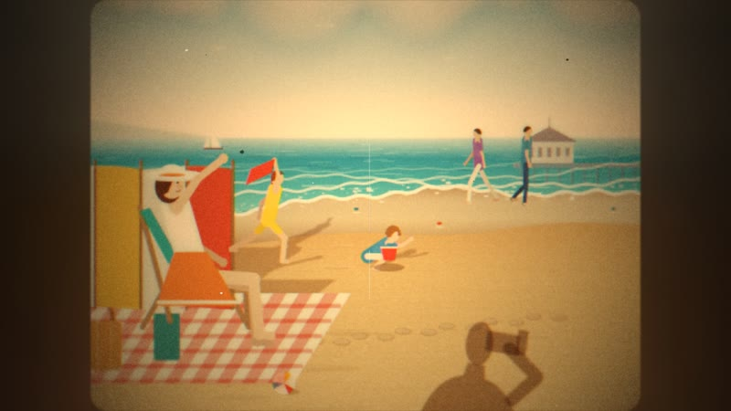</a><br><sup><b>★ Added here · 本仓库新增</b></sup><br><b>Super 8 Home Movie</b> · 老胶片家庭录像<br><i>Dad Was Here Too</i><br><sub>A father films his family&#x27;s 1976 seaside day without once appearing in it, until his daughter takes the camera and the reel burns out on him.<br>爸爸把 1976 年一家人的海边一天拍成一卷胶片，自己从没入镜；直到女儿接过摄影机，胶片在他身上烧尽。</sub></td>
</tr>
<tr>
<td width="33%" valign="top"><a href="styles/zoetrope/STYLE.md">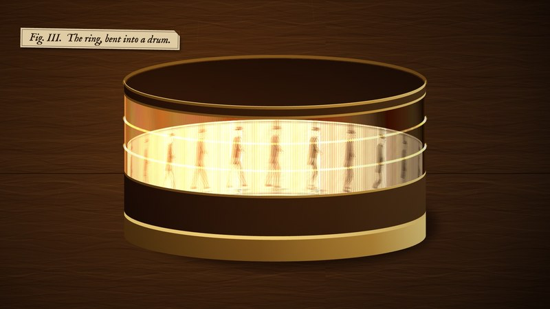</a><br><sup><b>★ Added here · 本仓库新增</b></sup><br><b>Zoetrope &amp; Phenakistoscope</b> · 前电影光学玩具<br><i>Nothing Moves</i><br><sub>A paper disc of twelve still bird drawings flies when it is spun past a slit and a mirror, flickers when too slow, flies backwards the other way, and crawls the wrong way under the film&#x27;s own 24 fps shutter; the ring unrolls into a strip and bends into a drum where a gentleman walks.<br>一张画着十二只静止小鸟的纸盘，转起来透过狭缝在镜中飞翔；太慢就闪烁，反转就倒飞，在影片自己的 24 帧快门下盘面还会倒爬；画环展开成纸带，卷成转筒，里面走起一位绅士。</sub></td>
</tr>
</table>

### Materials & 3D · 材质与 3D

<table>
<tr>
<td width="33%" valign="top"><a href="styles/brick-toy/STYLE.md">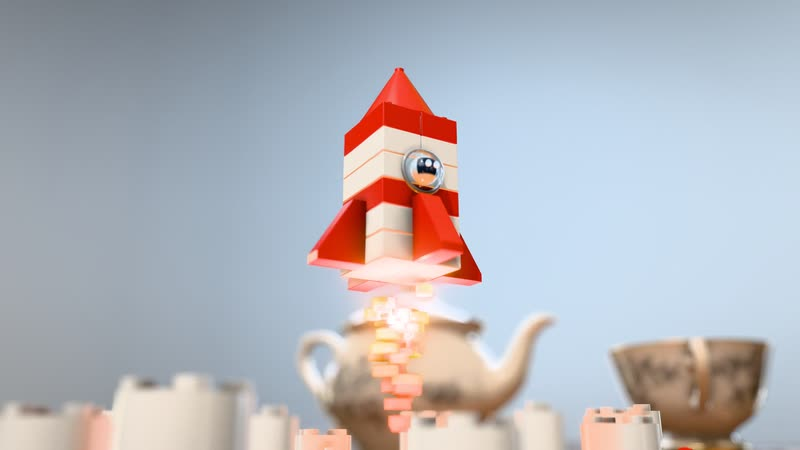</a><br><b>Brick Toy</b> · 积木玩具<br><i>Rocket from Spare Parts</i><br><sub>A brick astronaut builds a rocket from spare parts and flies to a brick moon.<br>积木宇航员用零件拼出火箭，飞向积木月亮。</sub></td>
<td width="33%" valign="top"><a href="styles/paper-popup/STYLE.md">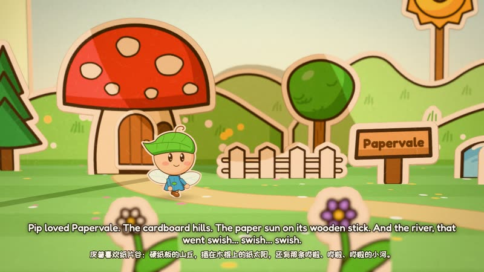</a><br><b>Paper Pop-up Book</b> · 纸片立体书<br><i>Pip&#x27;s Paper Adventure</i><br><sub>A pop-up book opens on a desk; a sprite named Pip adventures through paper worlds and jumps out into ours.<br>立体书在书桌上打开，小精灵 Pip 在纸片世界冒险，最后跳出书外。</sub></td>
<td width="33%" valign="top"><a href="styles/tilt-shift/STYLE.md">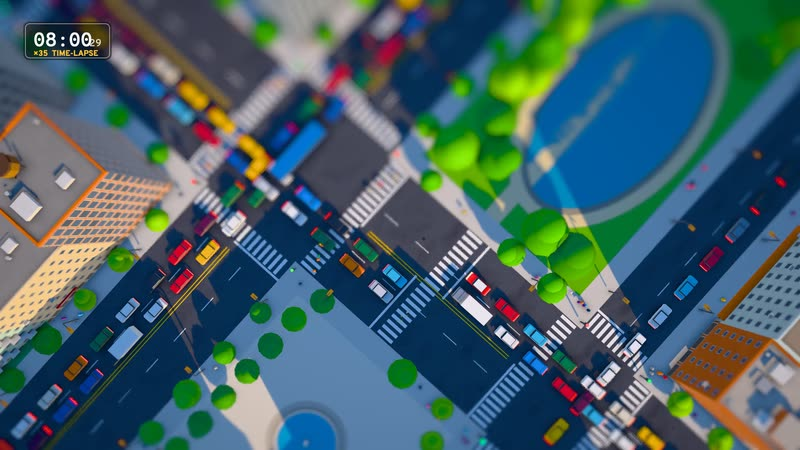</a><br><b>Tilt-Shift Miniature</b> · 移轴微缩<br><i>Toy Town Rush Hour</i><br><sub>Morning rush hour in a town that looks like a model: traffic, trains and tiny people.<br>玩具城的早高峰，一切都像模型。</sub></td>
</tr>
<tr>
<td width="33%" valign="top"><a href="styles/lowpoly-island/STYLE.md">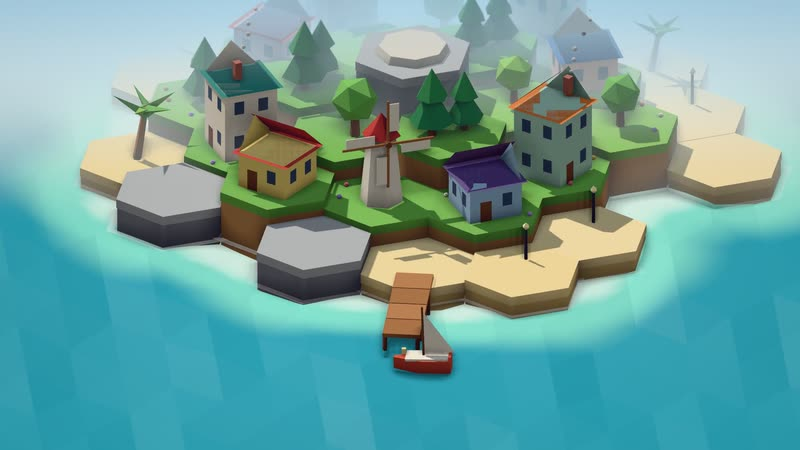</a><br><b>Low-poly Isometric Island</b> · 低多边形等距<br><i>The Island That Grew</i><br><sub>An island and its village grow tile by tile from an empty sea, each tile a note, into a starry night.<br>空海里一格格长出小岛和村庄，每放一块响一个音符，直到星空。</sub></td>
<td width="33%" valign="top"><a href="styles/glass-product/STYLE.md">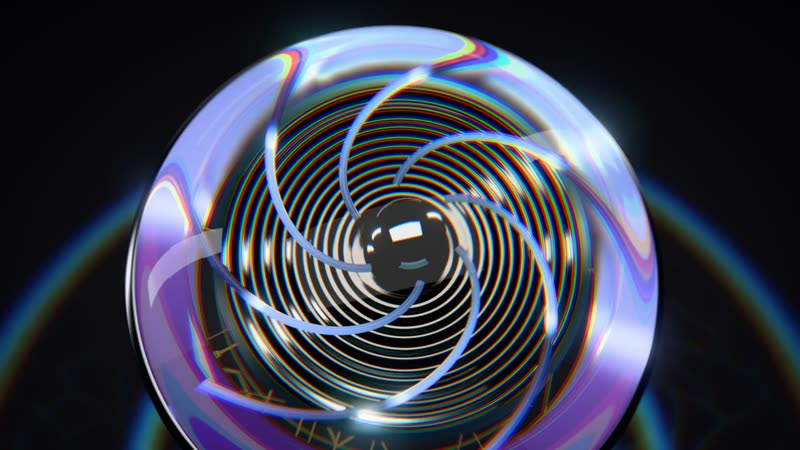</a><br><b>Glass Product Render</b> · 玻璃质感产品<br><i>Aura — Hear the Light</i><br><sub>Unboxing and close-ups of Aura, fictional glass earbuds, in strip-light sweeps and caustics.<br>虚构玻璃耳机 Aura 的开箱与特写。</sub></td>
<td width="33%" valign="top"><a href="styles/claymation/STYLE.md">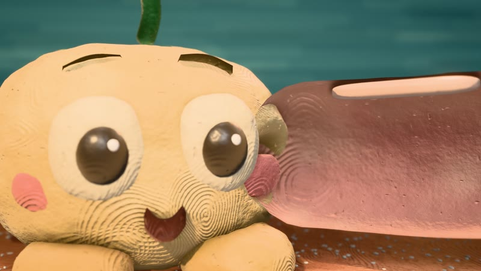</a><br><sup><b>★ Added here · 本仓库新增</b></sup><br><b>Claymation / Stop-motion</b> · 粘土定格动画<br><i>Proof</i><br><sub>A worried lump of dough on a hand-built kitchen counter waits all night to rise; at dawn a giant clay finger pokes it, and it springs back.<br>手捏小厨房里，一团忐忑的面团整夜不敢发酵；天亮时一根巨大的泥手指戳了它一下，它弹了回来。</sub></td>
</tr>
<tr>
<td width="33%" valign="top"><a href="styles/origami/STYLE.md">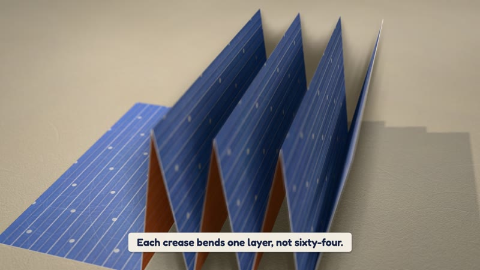</a><br><sup><b>★ Added here · 本仓库新增</b></sup><br><b>Origami Fold</b> · 折纸<br><i>The Seventh Fold</i><br><sub>A strip of paper is folded in half six times and the seventh will not close; the same strip is pleated, gathers into a wing, and opens with one pull.<br>一条纸带对折六次，第七次再也折不动；换成风琴褶，同一条纸带收成一排折页，一拉就展开。</sub></td>
<td width="33%" valign="top"><a href="styles/clockwork/STYLE.md">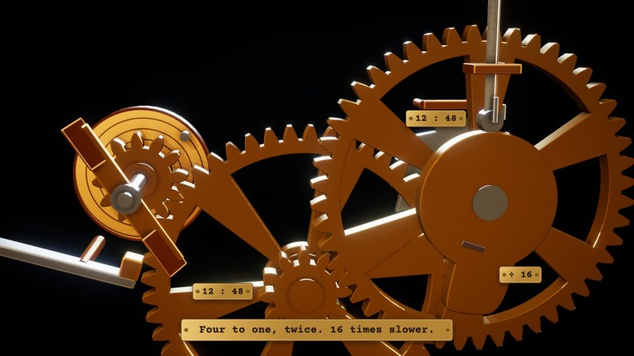</a><br><sup><b>★ Added here · 本仓库新增</b></sup><br><b>Clockwork &amp; Chain Reaction</b> · 发条机关<br><i>The Slowest Link</i><br><sub>A chain of brass links starts with a clock&#x27;s tick; one 16:1 gear train makes everything after it wait, and swapping a single pair of gears gives the same chain back six seconds.<br>一串黄铜机关从钟摆的一声滴答开始；其中一组 16:1 的齿轮让后面的一切等着，只换一对齿轮，同一条链就快了六秒。</sub></td>
<td width="33%" valign="top"><a href="styles/felt/STYLE.md">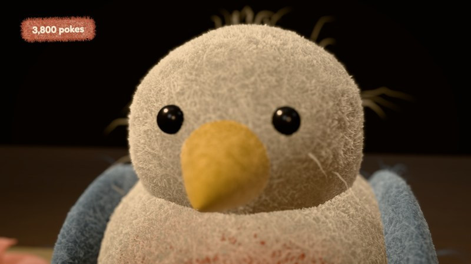</a><br><sup><b>★ Added here · 本仓库新增</b></sup><br><b>Needle Felting</b> · 羊毛毡<br><i>Mostly Air</i><br><sub>A cloud of wool is poked four thousand times by a barbed needle into a firm ball, a head, a beak and two wings, blended into a rust breast, and given two bead eyes; the bird blinks and peeps in a real silence, and the lamp goes out.<br>一团蓬松的羊毛被毡针戳了四千下：缩成紧实的球，接上头、嘴和翅膀，铁锈色的胸口在针下融进羊毛，缝上两粒黑豆眼；静默之后，它眨了一下眼，轻轻叫了一声，台灯熄灭。</sub></td>
</tr>
<tr>
<td width="33%" valign="top"><a href="styles/cardboard/STYLE.md">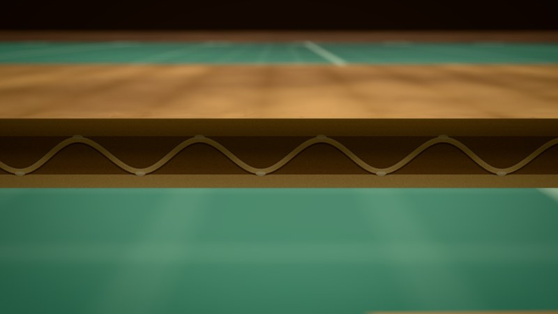</a><br><sup><b>★ Added here · 本仓库新增</b></sup><br><b>Corrugated Cardboard Craft</b> · 瓦楞纸手工<br><i>The Wave Inside</i><br><sub>A craft knife opens a board to show the wave between its liners; a thin card gives way under a tin, the same tin sits still on the board, and a flat-pack folded into a taped beam carries three.<br>美工刀划开瓦楞纸板，露出两层面纸之间的波浪；薄卡纸在铁罐下垮掉，同样的罐子在瓦楞板上纹丝不动，折成胶带封好的方梁后能扛三个。</sub></td>
</tr>
</table>
<!-- styles:end -->

## Licence & credits · 授权与来源

- **Original project · 原项目**: [Lemo-Opuscar](https://github.com/lemomo-ai/lemo-opuscar) by LemoLab × Claude Opus 5.5, MIT licensed. Its copyright notice is in [`LICENSE`](LICENSE) and applies to everything that comes from it. · 原项目 Lemo-Opuscar 由 LemoLab × Claude Opus 5.5 出品，MIT 协议；版权声明见 [`LICENSE`](LICENSE)，适用于所有来自它的内容。
- **Additions in this repository · 本仓库的新增**: the 30 styles, the talking-head workflow and the gallery updates were made by zhgarylu with Claude, and are offered under the same MIT licence. · 30 种新风格、口播加解说工作流和图鉴更新由 zhgarylu 与 Claude 一起做成，同样以 MIT 协议提供。
- **Third-party assets · 第三方素材**: assets in the demos keep their own licences (see each demo's `CREDITS`); you are responsible for the materials you use in your films. · 样片中的第三方素材沿用各自的授权（见各样片的 `CREDITS`）；你在自己片子里使用的素材由你负责。
