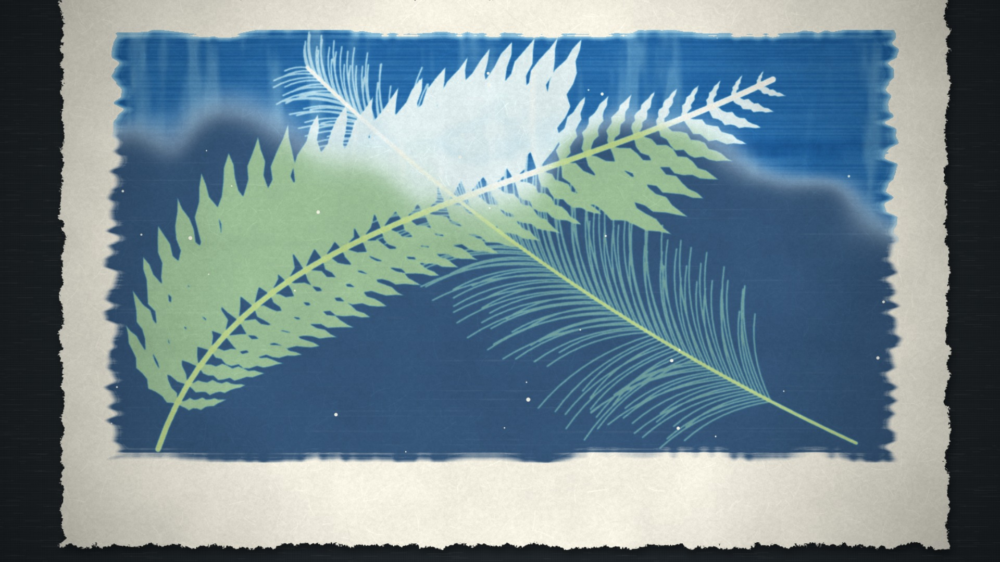

# Cyanotype — our demo

One example among many. Don't reuse its story, arc, shots, props or timings.

Demo: *Reading the Sun* (60 s) · `cyanotype.mp4` · source in [`demo/`](demo/)

## Story & structure

A maker has one frond, one feather and one chance, so she asks the sun how long to wait, six ways at once. A test strip is uncovered one band at a time; the wash shows pale, right and flat; the circled band fills the frame; then the real sheet is printed with exactly that much sun. Structure: a hook (the reveal first), a rewind to the brush, a question (how long?), a list that turns (six bands), a held silence, the payoff (the real print) and a pull-out to a line of prints. It ends with a three-line note written on the border and one drop falling where the film began (water).

Native moves spent: the wash-out reveal (twice, the second as the peak), exposure developing (under glass, as the card is drawn off), the test strip, objects lifted with ghosts left, drying darkens, the contact frame (the line of prints). Transitions: sheet-lift (three times), exposure flash (twice), wash front.

## Shots

| # | Time | Shot | Camera | Native move / note |
|---|---|---|---|---|
| 1 | 0–7.5 | A frond blooms white under a rinse; the title is written in gel pen | slow push on the whole sheet | wash-out reveal; title held 4.3 s |
| 2 | 7.5–12.5 | Bare paper, a hake brush lays three passes of coat | tracks the brush, 1.35× | the coat is the cause; wet lime, brush marks |
| 3 | 12.5–17.8 | The dry green sheet, a frond laid, glass slid on, a card on top, the sun arrives | pull back, slow push | silence-hush before the flash |
| 4 | 17.8–26.3 | The card is drawn off in six jerks on the beat; six bands darken | rides the card edge | the strip as a keyboard: one note per band |
| 5 | 26.3–34 | Glass and frond lift (ghosts), wash front runs left to right, digits and notes are written | lateral pan | pale / right / flat read at thumbnail size |
| 6 | 34.4–37.6 | The right band is circled; push into the fibres | push to 1.8× | the one detail that matters |
| 7 | 37.6–40 | Held: only a drip | locked | the near-silence; a bowl begins the next shot |
| 8 | 40.6–47.5 | The strip lifts; a fern and a feather fall in; flash; sun; objects lift, ghosts stay | locked, slight push | layered shadows, drop and lift |
| 9 | 47.5–52 | The wash on the real sheet | push toward the bloom | the peak |
| 10 | 52–60 | The print lifts, flash, hangs on a line; it dries and darkens; a note is written; pull out to the line; a drop falls into the tray | pull from 1.0× to 0.52× | contact frame and scale reveal |

## Score structure

96 BPM, 4/4 (bar 2.5 s), F-sharp minor pentatonic; i–VI–III–VII pad (F#m, D, A, E) in bowed glass tones; thumb-piano tines carry a five-note motif from the first brush stroke; in the strip the six notes F#4 A4 B4 C#5 E5 F#5 are struck as the six bands are uncovered (the picture and the score read the same event list); a soft bass on the beat and a shaker on the off-beats from the sun on; the wash opens the pad with a bell chord; the motif turns an octave down. Silences: the hush before the first sun flash (0.3 s of music gated out, the pad only), and 37.6–39.55 s, where only a drip at 38.05 sounds; the first sound after it is a low bowl on the downbeat at 40.0 s. The final chord is bells on F#m, one bell for the last drop. Voice about 11 dB above the music; the mix measures −14.0 LUFS.

## Palette & props

Paper `#f4f0e2`, Prussian ramp `#0a2250 → #2062a0 → #b2d7e4`, coat lime `#cfd87e`, linen room `#1e2428`, plaster `#6c7a76`, ink `#143a74`, gel pen `#fafcff`. Props: a wide hake brush with a wooden handle, a glass pane with a teal edge, a black card, two wooden pegs, a line, an enamel tray, a fern frond, a quill feather, a ginkgo-like fan, an umbel, a grass spray, a cut-paper house plan. All invented, all drawn in code.

## End card

None. The film ends on the pulled-out line of prints and the last drop in the tray.

## Build notes

- `sh styles/cyanotype/demo/build.sh` renders everything (about 5 minutes with 3 workers): timeline → Kokoro voice (bf_emma) → speech check → captions → cue check → mix → srt → readcheck → frames → an intermediate encode → mux (−14 LUFS, a little grain) → styleframe and poster.
- Files: `timeline.js` (times, camera keys, `EV` event list, card and dose functions), `main.js` (scenes, sprites, pen text, captions, `TEXTS`), `engine/plate.js`, `engine/shapes.js`, `engine/noise.js`, `mix.py`, `lines.json`, `tools/` (`export_tl.mjs`, `make_caps.mjs`, `cuecheck.py`), `fonts/` (see `CREDITS`).
- Preview a state: `node core/render/still.mjs styles/cyanotype/demo 49.2 --q nosub=1`.
- Pitfalls tied to this demo's props: the glass and card are drawn in the strip's frame so they lift with it; the frond sprite and the frond light map share one geometry, change both together; the strip's dose-per-column table is computed once from `cardEdge(t)`; the hung print reuses the real sheet's plate, so its `dry` state continues from the table scene.
