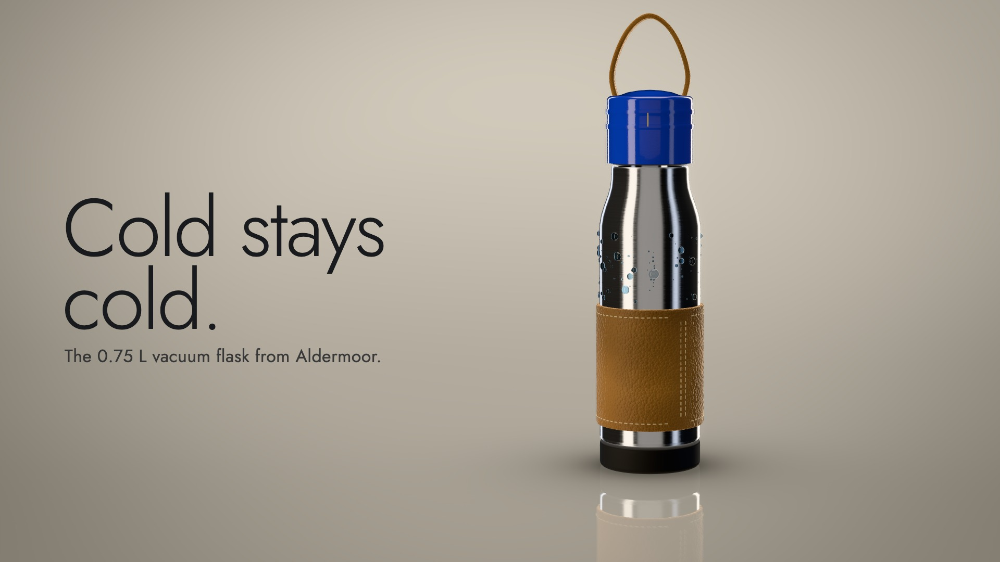

# Product Hero Macro — our demo

One example among many. Don't reuse its story, arc, shots, props or timings.

Demo: *Tide Flask* (52.5 s) · `product-hero.mp4` · source in [`demo/`](demo/)

## Story & structure

A drop of condensation sticks, then slides down a brushed-steel flask in macro while a diagonal edge of light wipes the dark frame open. The light carries on: the flask stands in the studio with its tagline, "Cold stays cold."; the light crosses its leather sleeve (pebble grain, hand stitching), its glazed cobalt cap (which turns half a turn to seal), then everything goes quiet and the object pulls apart on a tilted axis into cap, seal, liner, body, sleeve and base, each labelled by a growing leader. After a second of near silence it snaps shut on a click and a low thump. The last act is a day: one big numeral, 24h, a line that runs from 00 to 24 while the light crosses the steel and the condensation grows. The film ends on a low wide shot with the reflection, the wordmark, the name, the price and the address in a cobalt pill.

Why it fits: the product's claim (cold) is made visible by a drop of water, the light that reveals each material is also the clock of the claim, and the cobalt of the cap is the only colour in the type. Native moves used: light wipe, sliding drop with beads, sweep over leather and steel, rack-focus cuts, exploded column with labels, the snap, the day line, the price card.

## Shots

| # | Time | Shot | Camera | Native move / note |
|---|---|---|---|---|
| 1 | 0.0-5.0 | macro of steel, a drop sticks, then slides | slide and dolly, 14 to 11.8 cm, follows the drop | light wipe from black; the kicker TIDE FLASK |
| 2 | 5.0-12.5 | the flask, low 3/4, product right | push 158 to 142 cm and a 20 degree orbit | tagline in the left space; sweep crosses leather |
| 3 | 12.5-20.0 | leather sleeve, product left | tracks up 6 cm while orbiting 16 degrees | callout 01; sweep, stitches, grain |
| 4 | 20.0-25.0 | the cap from above | orbit 44 degrees, 48 to 40 cm | callout 02; the cap turns half a turn with ratchet ticks |
| 5 | 25.0-35.0 | the exploded column, tilted 15 degrees | pull-back orbit 335 to 310 cm | callout 03; six labels; silence; the snap at 33.75 s |
| 6 | 35.0-42.5 | steel body and sleeve edge | slow orbit 84 to 68 cm | 24h, day line 00-24, drops grow, sweep runs once round |
| 7 | 42.5-52.5 | low wide, product left, reflection | push 162 to 150 cm | wordmark, name, price, pill; held 5 s |

Every cut (5.0, 12.5, 20.0, 25.0, 35.0, 42.5 s) is a rack-focus blur: focus pulled to the near plane, aperture and exposure dip, camera changes under the blur.

## Score structure

96 BPM, 4/4 (bar 2.5 s), A minor pentatonic with the ninth: Am9, Fmaj7, Cmaj7, G6. 0-5 s: an A1 swell under the reveal, no harmony. From 5 s: pad and strummed electric piano on the bar, sparse melody, sub pulse on beats 1 and 3, off-beat plucks from bar 3. Shots 3-4 add the C and G chords and a denser pluck. In the exploded view the pulse and the chords keep going until 32.25 s, then 1.4 s with only room tone and a faint ring (silence 1); the snap (five tiny clicks, a 62 Hz thump, a ring) is the first sound after it. The day shot has a pulse on every beat and plucks on every eighth, with a tick every six hours. Music stops at 41.75 s (silence 2); the end card starts on a bare Am9 pad, the price lands on a bell chime at 46.6 s, the pulse stops before it, and a held A and E ring out to the end. Foley: light whooshes at each sweep, a swell and a low tap at each cut, water plinks and a wet squeak for the drop, leather rub, ceramic ticks, a ratchet for the cap, soft clicks for each part, tiny UI ticks for callouts. Reverb on music and a send for foley; dry foley close.

## Palette & props

Putty backdrop `#8d8579` with a pool `#d9d2c5` and darker edges `#3a3631`; ink `#181a1d`; the product's accent, cobalt `#1d46c7`; brushed 18/8-style steel, vegetable-tanned leather in honey tan with cream thread, silicone base in near-black. Jost light for display, regular and medium for callouts. The brand (Aldermoor), the product (Tide Flask), the price and the address (aldermoor.example/tide) are invented; there is no logo. All facts in the film are the film's own.

## End card

Wordmark ALDERMOOR (tracked caps), Tide Flask, the tagline repeated small, $48, and a cobalt pill with the address. Held about five seconds after the pill lands. This demo has no separate sign-off card.

## Build notes

Files in `demo/`: `index.html`, `main.js` (page contract, cove shader, environment rig, mirrored twin, light-wipe pass, camera, type layer, TEXTS), `product.js` (lathe parts, materials, strap ribbon, stitches, droplets), `textures.js` (procedural canvases), `timeline.js` (shots, sweep track, exploded view, type table, sound events), `mix.py`, `build.sh`, `CREDITS`, `TREATMENT.md`.

`sh styles/product-hero/demo/build.sh` (core tier only) runs: font fetch, events export, reading check, mix, render (about five minutes with two workers on a GPU), mux (−14 LUFS), style frame and poster.

Pitfalls tied to this demo: the environment is rebuilt every frame (PMREM) so a still never needs the previous frame; `window.TEXTS` computes layout without rendering so the reading check is fast; the tilted exploded column needs the mirrored twin nested under a y-flipped group (not a negative scale on the same group that is rotated); the quarter-turn of the cap would turn the strap edge-on, so the cap turns a half turn; droplets and the sliding drop are children of the body so they travel with it in the exploded view.
