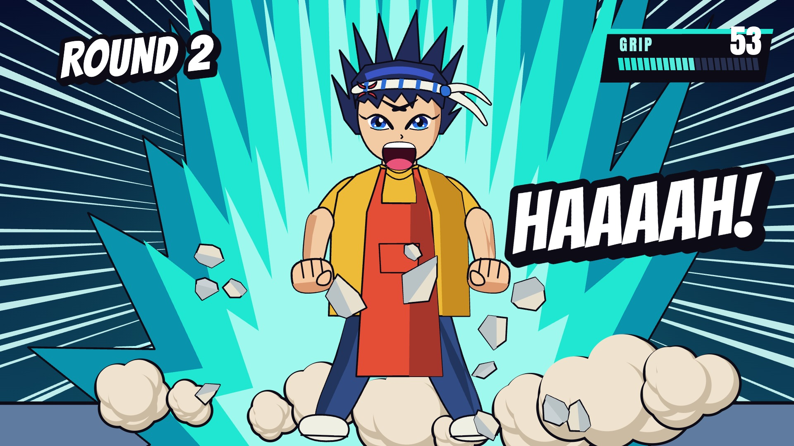

# Shonen Battle — our demo

One example among many. Don't reuse its story, arc, shots, props or timings.

Demo: *Round One: The Jar* (60 s) · `shonen-battle.mp4` · source in [`demo/`](demo/)

## Story & structure

Haru, a twelve-year-old apprentice cook, has ten minutes to open her grandmother's pickle jar, sealed for three years. The film treats the jar as a rival: a strip of eyes, the jar in violet flames, a title slam, a diagonal face-off with name plates. Round one is pure effort (teeth, vein, sweat, a trembling outline) and ends with "Nothing." Round two is overkill: a teal aura, a floor that cracks, rubble rising, and a lid that does not move. Then three seconds of silence, a memory in pastel split panels (the grandmother taps the rim with a spoon and says to let a little air in), and the long charge: low-angle stance, floating debris, a meter reading ???, an accelerating heartbeat, closed eyes. Everything stops. Eyes open; three drawings of a wooden spoon, two impact frames, and the sound of a small "tink". A hiss, then POP: the lid flies out and the violet aura shatters. A slow-motion fall in a split panel, a smile, and the last gag: the grandmother calls dinner, then asks what happened to the floor. A close-up of Haru's eyes, with a jar reflected in them, and "TO BE CONTINUED".

Why it fits: the hold-then-burst rhythm carries the whole film; the stakes are stated at maximum and the answer is gentle, so the comic and the heroic are the same grammar at different sizes. Native moves used: the face-off, round cards, the power meter, the charge, the three-frame release into the impact frame, hush after the hit, the aura shatter, the reaction panel, floor cracks and rising debris.

## Shots

| # | Time | Shot | Camera | Native move / note |
|---|---|---|---|---|
| 1 | 0.0-0.4 | black, fridge hum | - | the sound first |
| 2 | 0.4-2.4 | Haru's eyes in a slanted strip, cream field, black focus lines | slow push 8 % | extreme close-up; a light sweep at 1.4 |
| 3 | 2.4-4.5 | the jar in violet flames, glare slits on the glass | dutch tilt, push | rival introduced |
| 4 | 4.5-7.5 | kitchen at dusk, boy small, jar huge; THE JAR slams in a burst | push, shake on the slam | title card |
| 5 | 7.5-14.0 | diagonal split, auras rising, lightning gutter, plates | slow push in both halves | the face-off |
| 6 | 14.0-19.0 | round 1: grip on the lid, teeth, vein, sweat; NNNGH! | slow push | the power meter (12) |
| 7 | 19.0-22.4 | round 2: low-angle stance, teal aura, dust, rubble; HAAAAH! | push, heavy shake | meter jumps to 53 |
| 8 | 22.4-25.0 | the jar on the cracked floor, unmoved | push | the cost |
| 9 | 25.0-28.0 | Haru slumps; ticks and drips; meter at 0 | slow pull-out | silence 1 |
| 10 | 28.0-34.0 | pastel split: grandmother's spoon taps the rim; Haru remembers | slow push | calm as colour; then a black wedge wipes to the charge |
| 11 | 34.0-38.5 | the charge: aura rises, cracks re-grow, debris floats, meter ??? | push 0.9 to 1.12 | the long hold |
| 12 | 38.5-41.0 | fist, spoon flies into it | push | the tool |
| 13 | 41.0-44.0 | closed eyes, grit; at 43.72 the eyes open | push 16 % | sound stops at 43.4: silence 2 |
| 14 | 44.0-44.125 | spoon: wind-up, smear, contact | locked | 3 drawings |
| 15 | 44.125-44.21 | impact frames: inverted, then plain high-contrast | - | the genre's signature |
| 16 | 44.21-46.0 | calm kitchen, spoon on the rim, "tink", hiss wisps | slow push | the anti-climax |
| 17 | 46.0-47.85 | POP: lid rockets out, aura shatters, reaction inset | whip tilt up and back | consequence |
| 18 | 47.85-50.4 | split: lid tumbling in slow motion / Haru's face | locked | reaction panel |
| 19 | 50.4-52.0 | Haru with the open jar, warm rays | push | heart |
| 20 | 52.0-57.3 | the kitchen floor in ruins; "what happened to the floor?" | wide, then push 2x to her face | the joke; GULP |
| 21 | 57.3-60.0 | eyes with a jar in the iris; letterbox closes | push | bookend; TO BE CONTINUED |

Stills: [title](demo/stills/frame_title.jpg) · [face-off](demo/stills/frame_faceoff.jpg) · [strike](demo/stills/frame_strike.jpg) · [pop](demo/stills/frame_pop.jpg) · [floor](demo/stills/frame_floor.jpg)

## Score structure

120 BPM, A minor, bar = 2 s. Silence until the title; then a brass stab on Am and a pulse-bass groove with taiko on 1 and 3 and hat ticks (from 8.0), a four-note brass riff over bars 10-14. Round one thins to a drone, a slow heartbeat and a tension cluster. Round two is a wall of drums with the riff an octave up, stripped back at 22.4 and cut dead at 24.95. Silence 1 (25-28) is the room: fridge hum, clock ticks, two drips. The memory is a music-box melody over a warm pad (C major leaning). The charge is a heartbeat whose interval halves from 1 s to 0.11 s, a drone and two brass swells, with a rising hum in the foley; at 43.4 everything stops (silence 2, 0.7 s). After the strike a short boom, then 1 s of room and one small tink; a hiss; POP at 46.0 opens a major brass chord and a theme on the music box with a walking bass. At 53.5 the music stops mid-bar for the question. The last bars are a minor stab on the end card. Foley, shouts (formant-synthesised "ah") and score are numpy; the narrator is Kokoro. Mix: music ducked about 5 dB under voice, impacts and shouts the loudest layer, a short hall on the wet bus, −14 LUFS with a limiter (crest is high).

## Palette & props

Ink `#0d0b16`; Haru: skin `#f7c9a1`, navy hair `#1c2150`, tea-towel headband white with blue stripes, mustard tee, vermilion apron; hero cyan `#0a93ad` `#1fe7d2` `#9ff8ee`; the Jar: glass green with olive brine and pickles, steel lid, violet `#7a22d8` `#d03ee6` `#ff4a8a`; the kitchen at dusk in peach and aubergine; impact yellow `#ffe14a`. Props: a wooden spoon, tile chunks, a clock-like tick (sound only). Grandmother is a voice, a lilac sleeve and a hand.

## End card

"TO BE CONTINUED" with an arrow on a black plate, over Haru's eyes in a closing letterbox; in her iris, a tiny jar silhouette. No sign-off or credit on screen.

## Build notes

- Run `sh styles/shonen-battle/demo/build.sh` from anywhere (needs `setup.sh deps voice`). It takes about 5 minutes: voice 20 s, mix 15 s, render 2 min with 2 workers, mux 30 s.
- Files: `ink.js` (toolbox), `art.js` (characters and set), `film.js` (shots and overlays), `timeline.js` (shots, shake table, voice, sound events), `main.js` (page contract, impact-frame filter), `mix.py`, `lines.json`, `tools/export_tl.mjs`.
- The impact frame is made in `main.js`: the finished canvas is drawn again through `grayscale(1) contrast(9)` (inverted on the first frame).
- Text that flashes cannot pass the reading check: every sound word is held 1.7-2.5 s (the pop-in scale shortens the "fully visible" time slightly, so pad by 0.1 s).
- Pitfalls tied to this demo's props: the cracks must be clamped to the floor plane (`floor: true`) or they climb the wall; the lid's flight is a monotone ease so it does not drop back into the shot.
